# YouNew App Information Architecture

Audit date: 2026-06-13  
Objective: convert YouNew from a collection of screens into a structured national guide platform for life in the Netherlands.

## Target Principle

Each topic has one canonical owner. Other screens may reference that owner, but should not duplicate or impersonate it.

## Final Taxonomy

| Category | Canonical Screen / Destination | Owns | Must Not Own |
|---|---|---|---|
| HOME | HomeView | next actions, status, current city, urgent shortcuts | full content library |
| COUNTRY | NetherlandsOverviewView | national overview, Dutch identity, basic orientation | city/province details |
| PROVINCES | ProvinceDirectoryView | province pages, province cards, province facts | city-specific service guidance |
| CITIES | CitiesDirectoryView + NetherlandsCityDetailView | city identity, places, municipality links, local context | national rules |
| LIFE IN NETHERLANDS | InformationHubView | daily-life entry point, guide index | official source directory |
| WORK | GuideContent.workSection | permits, employment, payslip, job search | generic institution browsing |
| HOUSING | GuideContent.housingSection | renting, tenant rights, rent support | mistakes library as primary content |
| HEALTHCARE | GuideContent.healthcareSection | insurance, GP, urgent care | map as primary content |
| EDUCATION | KNMGuideView / DUO-linked modules | KNM, school/education links, integration exam references | language course content |
| LANGUAGE | LanguageHubView + DutchA1A2View | Dutch learning, terms, A1/A2 lessons | integration legal obligations unless linked |
| DOCUMENTS | GuideContent.documentsSection + DocumentOrganizerView | BSN, DigiD, BRP, letters, document checklist | fines |
| MONEY | PracticalGuide.bankingBasics + tax/work article references | banking, payments, tax overview | work permits |
| TRANSPORT | GuideContent.transportSection / TransportGuideView | OV, trains, bikes, travel planning | city tourism |
| GOVERNMENT | GovernmentHubView + OfficialSourceDirectoryView | official services, municipality, institutions, scam checks | personal legal advice |
| EMERGENCIES | EmergencyHubView | emergency actions, 112, police, crisis contacts | routine healthcare |
| CULTURE | CultureAttractionsView | daily culture, attractions, museums | full history course |
| HISTORY | NetherlandsHistoryView + HistoryKNMHubView | Dutch history timeline and KNM context | tourism listings |
| AI ASSISTANT | AIAssistantView | navigator, explainer, translator, official-source guide | final decisions/advice |
| SETTINGS | SettingsView | preferences, privacy, legal, reset onboarding | life guidance content |

## Site Map

```mermaid
flowchart TD
    Home["HOME Dashboard"]
    Search["Search"]
    Map["Map"]
    Saved["Saved"]
    AI["AI Assistant"]
    More["More"]

    Home --> Country["Country"]
    Home --> Cities["Cities"]
    Home --> Life["Life in Netherlands"]
    Home --> Emergency["Emergencies"]
    Home --> Documents["Documents"]
    Home --> AI

    More --> Government["Government"]
    More --> Work["Work"]
    More --> Housing["Housing"]
    More --> Healthcare["Healthcare"]
    More --> Education["Education"]
    More --> Language["Language"]
    More --> Money["Money"]
    More --> Transport["Transport"]
    More --> Culture["Culture"]
    More --> History["History"]
    More --> Settings["Settings"]

    Map --> Provinces["Provinces"]
    Map --> Cities
    Map --> Nearby["Nearby Services"]

    AI --> OfficialSources["Official Sources"]
    Government --> OfficialSources
```

## Navigation Hierarchy

Primary tabs:

| Tab | Role | IA Rule |
|---|---|---|
| Home | Dashboard | Helps answer "what should I do next?" |
| Search | Find anything | Utility, not category owner |
| Map | Location-aware view | Shows nearby services and province/city geography |
| Saved | User memory | Stores references, does not create new categories |
| AI Assistant | Explainer/navigator | Points to verified sections |
| More | Full library | Owns the complete category list |

More is now a real navigation stack:

- `RootTabView.swift:593` separates Home and More.
- `RootTabView.swift:647` gives More its own `NavigationStack`.
- `RootTabView.swift:941` makes the More tab open the More hub instead of only opening the side menu.

## Content Ownership Map

| Content | Owner | Reference Pattern |
|---|---|---|
| BSN | DOCUMENTS | Home quick action, AI, Government may link |
| DigiD | DOCUMENTS | Government and AI may link |
| BRP | DOCUMENTS / GOVERNMENT | City pages should link to municipality registration |
| Residence permits | WORK / GOVERNMENT | AI and Search link to IND-backed pages |
| Payslip and taxes | WORK + MONEY | Work owns employment context; Money owns banking/payments |
| Huurtoeslag | HOUSING + MONEY reference | Housing owns renter context; Money may reference benefits |
| GP and insurance | HEALTHCARE | Map only finds nearby providers |
| 112 / crisis contacts | EMERGENCIES | Home may shortcut |
| OV / NS / bike | TRANSPORT | City pages may show local links |
| Dutch A1/A2 | LANGUAGE | Integration can reference it |
| Inburgering / KNM | EDUCATION | Language can reference it |
| Dutch history | HISTORY | Culture can reference it |
| Attractions and museums | CULTURE | City pages hold local places |
| LGBTQ+ support | SUPPORT | Healthcare/emotional support can reference |
| Official sources | GOVERNMENT | Every high-risk section links here |

## Feature Ownership Map

| Feature | Owner | Status |
|---|---|---|
| AI context builder | AI ASSISTANT | PASS: source-oriented guardrails present |
| Official sources directory | GOVERNMENT | PASS |
| Document organizer | DOCUMENTS | PASS as tool |
| Letters examples | DOCUMENTS | PASS as sub-tool |
| Mistakes library | LIFE IN NETHERLANDS | PASS as reference, not category owner |
| Institutions list | GOVERNMENT | PASS as directory, not Work/Money owner |
| Fines library | GOVERNMENT / MONEY | PASS |
| Nearby map | MAP | PASS as location utility |
| LGBTQ+ support | SUPPORT | FIXED: now AppDestination-owned |
| More hub | MORE | FIXED: now reachable as tab stack |
| Translator | LANGUAGE or AI ASSISTANT | ORPHAN: decide one owner |
| LegalInfo | GOVERNMENT | ORPHAN: decide whether to replace Legal help |
| MunicipalitySupport | GOVERNMENT | ORPHAN: merge into municipality guide |

## User Journey Map

Assumption: Home starts at the top of the dashboard. Tap counts below count visible navigation taps, not scrolling.

| User | Needs | Target Flow | Tap Count | Status |
|---|---|---|---|---|
| New refugee | emergency, municipality, documents, healthcare | Home -> More -> Emergencies / Government / Documents | 2 | PASS after routing fixes |
| International student | DigiD, BSN, housing, transport, education | Home -> More -> Documents / Housing / Transport / Education | 2 | PASS |
| EU worker | BSN, work, tax, healthcare | Home -> More -> Work / Money / Healthcare | 2 | PASS after Work route fix |
| Non-EU worker | IND/work permit, sponsor, municipality | Home -> More -> Work / Government | 2 | PASS after Work route fix |
| Tourist | emergency, transport, culture, city info | Home -> More or Map -> Transport / Culture / Cities | 2 | PASS |
| LGBTQ newcomer | safe support, legal/social resources, emergency | Home -> More or Help -> LGBTQ+ support | 2 | PASS after LGBTQ route fix |
| Family with children | registration, healthcare, education, housing | Home -> Help -> Family path, or More -> Education / Housing | 2 | PASS after Family route fix |

## Home Screen Cleanup Standard

Home should answer only:

1. What should I do next?
2. What is important today?
3. Where can I get help?
4. What city am I in?
5. What documents do I need?

Recommended Home sections:

| Keep on Home | Move Out of Home |
|---|---|
| Current status and next steps | Long history/culture content |
| Current city card | Full category library |
| Emergency shortcut | Deep guide article lists |
| Documents shortcut | Repeated province/city exploration blocks |
| Search / AI prompt | Non-urgent educational content |

Home is still too content-rich for the final IA target. This was documented, not redesigned, because the current pass focused on blocker-level routing contradictions.

## AI Assistant Rules

AI must act as:

- Navigator
- Guide
- Explainer
- Translator
- Assistant

AI must not act as:

- Immigration lawyer
- Tax adviser
- Doctor
- Final authority on benefits
- Replacement for municipality/IND/Belastingdienst/DUO/CJIB/healthcare sources

Current support:

- AI context includes mandatory disclaimer and official-source posture.
- High-risk categories should always include a link to the canonical owner and Official Sources.
- AI should say "check the official source" for legal, medical, tax, immigration, benefits, and emergency content.

## Remaining IA Blockers

| Severity | Issue | Root Cause | Recommended Fix |
|---|---|---|---|
| High | Home is still a content dump risk | Too many sections attempt to solve discovery, education, and journey guidance simultaneously | Convert Home to a dashboard and move library browsing to More |
| High | Orphan views exist | Screens were added without AppDestination ownership | Remove or assign LegalInfo, Translator, MunicipalitySupport, Risks, SurvivalGuide |
| High | Fact source metadata is uneven | Older articles predate `updatedDate` / `readingMinutes` use | Normalize all guide articles |
| Medium | More hub and side menu overlap | Two global navigation systems coexist | Keep More as library and side menu as quick launcher, or merge |
| Medium | PracticalGuide and GuideContent overlap | Task modules and article sections are both top-level | Treat GuideContent as canonical knowledge and PracticalGuide as task workflow |

## Final IA Verdict

Verdict: INTERNAL TESTFLIGHT WITH IA RISKS.

The app is now more predictable than before this pass because the most obvious wrong routes were fixed. It is not yet a final public-release IA pass because Home is still too broad, orphan views remain, and fact metadata needs normalization.
