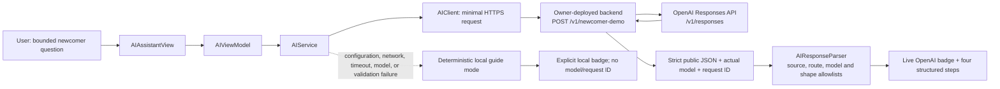

# GPT-5.6 integration evidence

Evidence cutoff: 2026-07-20 (Europe/Amsterdam)

Branch: `build-week-readiness`

Scenario: `BuildWeekNewcomerDemo`

## Evidence verdict

The repository contains a bounded iOS-to-backend GPT-5.6 implementation, an undeployed Cloudflare Worker reference, exact structured-response validation, and an explicit deterministic local fallback. Official OpenAI documentation reviewed for this work confirms the GPT-5.6 family, the Responses API, and Structured Outputs contract.

**Live status: BLOCKED / NOT PROVEN.** At the evidence cutoff, `OPENAI_API_KEY`, `OPENAI_MODEL`, and `YOUNEW_AI_BACKEND_URL` were not configured in the working environment. No backend deployment, live OpenAI request, actual live `model` value, or live provider `requestId` has been captured. Contract fixtures and mocked upstream tests below are not presented as live evidence.

## Official contract check

The implementation was checked against these official OpenAI materials:

- [GPT-5.6 announcement](https://openai.com/index/gpt-5-6/)
- [Latest model guidance](https://developers.openai.com/api/docs/guides/latest-model)
- [GPT-5.6 Sol model reference](https://developers.openai.com/api/docs/models/gpt-5.6-sol)
- [Structured Outputs](https://developers.openai.com/api/docs/guides/structured-outputs)
- [Production best practices](https://developers.openai.com/api/docs/guides/production-best-practices)
- [Safety best practices](https://developers.openai.com/api/docs/guides/safety-best-practices)

This confirms the documented API/model contract, not access by the owner's OpenAI account and not runtime availability from an undeployed YouNew backend.

## Architecture



Trust boundaries:

1. The iOS app never receives or stores the OpenAI API key.
2. The client sends only the question, locale, scenario/version identifiers, and four knowledge-record IDs.
3. The backend owns instructions, bounded facts, official source URLs, app routes, the OpenAI credential, and the selected model.
4. A response is labelled live only after exact model allowlisting, a safe request ID, exact four-step source/route matching, output bounds, and language validation.
5. Every failed live-path check resolves to visibly labelled local guide mode for the named scenario.

## Implementation files

### iOS client

- `YouNew/Services/BuildWeekNewcomerDemo.swift` — scenario/version, exact GPT-5.6 allowlist, four knowledge contracts, multilingual named prompt, deterministic fallback.
- `YouNew/Models/AIContext.swift` — `liveOpenAI`, `localGuide`, `unverified`, and `safety` origins plus model/request metadata.
- `YouNew/Services/AIClient.swift` — minimal request, HTTPS endpoint validation, ephemeral session, timeouts, and response-byte bound.
- `YouNew/Services/AIService.swift` — live attempt and fail-closed local fallback.
- `YouNew/Services/AIResponseParser.swift` — strict public-response, source, route, model, request-ID, length, and language checks.
- `YouNew/Services/AISafetyFilter.swift` — local input and output safety checks.
- `YouNew/ViewModels/AIViewModel.swift` — named-flow dispatch, cache bypass, origin enforcement, and pre-persistence safety/privacy evaluation.
- `YouNew/Views/AIAssistantView.swift` — visible response origin, live model/request metadata, four step identifiers, guide actions, and source actions.
- `YouNew.xcodeproj/project.pbxproj` — `YOUNEW_AI_BACKEND_URL` build-setting bridge; it contains no endpoint value or credential.

### Backend reference

- `BackendExamples/cloudflare-worker-ai-proxy.js` — undeployed Worker implementation.
- `BackendExamples/cloudflare-worker-ai-proxy.test.mjs` — mocked-upstream contract, failure, safety, timeout, and size-limit tests.
- `BackendExamples/package.json` — local test command only.
- `BackendExamples/README.md` — contract and owner deployment boundary.

### Verification

- `YouNewTests/BuildWeekNewcomerDemoTests.swift`
- `YouNewTests/AIFoundationTests.swift`
- `YouNewUITests/YouNewUITests.swift`
- `scripts/ai-subsystem-static-qa.py`

## Environment variables — names only

| Boundary | Name | Required | Treatment |
|---|---|---:|---|
| Backend | `OPENAI_API_KEY` | Yes for live | Encrypted platform secret; never put in iOS, plist, source, bundle, report, or Git. |
| Backend | `OPENAI_MODEL` | Yes for live | Explicitly one of `gpt-5.6`, `gpt-5.6-sol`, `gpt-5.6-terra`, or `gpt-5.6-luna`; there is no default or silent substitution. |
| iOS build | `YOUNEW_AI_BACKEND_URL` | Yes for live | Full owner-controlled HTTPS URL ending in `/v1/newcomer-demo`; HTTP is accepted only for explicit loopback debug/test use. |

`.env.example` contains empty placeholders only. No values are recorded in this evidence.

## Network and model contract

Public endpoint: `POST /v1/newcomer-demo`

Provider endpoint used only by the backend: `POST https://api.openai.com/v1/responses`

Client request keys are exact:

```json
{
  "question": "",
  "locale": "",
  "scenario": "BuildWeekNewcomerDemo",
  "contextVersion": "newcomer-after-address.v1",
  "knowledgeRecordIDs": []
}
```

The client does not send conversation history, saved items, completed guides, current route, profile data, a system prompt, official URLs, source text, or credentials.

Model validation is fail-closed:

- backend configuration accepts exactly the four model names listed above;
- a configured explicit variant must equal the actual `data.model` returned by OpenAI;
- the `gpt-5.6` alias may resolve only to `gpt-5.6` or `gpt-5.6-sol` in this contract;
- the backend copies the actual allowed `data.model` into the public `model` field;
- the backend uses a safe OpenAI `x-request-id` when present, otherwise its generated opaque request ID;
- the iOS parser independently accepts the same exact four-model set and requires a bounded request-ID format;
- a mismatch becomes a safe error and then local guide mode, never a differently named live response.

## Bounded grounding

The server-owned context maps the four client identifiers to existing YouNew records, a cautious status, bounded facts, an exact official source, and an exact in-app route:

| Order | Client knowledge ID | Status represented | Official source | App destination |
|---:|---|---|---|---|
| 1 | `topic:registration-bsn` | Depends on registration/situation | Government.nl — Citizen service number (BSN) | `practicalGuide:municipalityRegistration` |
| 2 | `topic:digid` | Recommended after prerequisites | DigiD — Apply and activate | `practicalGuide:digidSafety` |
| 3 | `government-service:health-insurance` | May be mandatory depending on status | Government.nl — Health insurance | `practicalGuide:healthInsuranceBasics` |
| 4 | `government-service:gp` | Recommended; availability varies locally | Government.nl — Moving to the Netherlands | `practicalGuide:findingHuisarts` |

The model cannot replace these source titles, URLs, destinations, order, or record IDs. The Worker rejects invented timelines and guarantee language and appends municipality/status caveats. This is bounded orientation, not a legal, medical, immigration, insurance, entitlement, or deadline guarantee.

## Contract fixture — not a live response

The following anonymized sample documents the tested public contract. The upstream OpenAI call was mocked; the model and request ID are fixture values.

Request fixture:

```json
{
  "question": "I recently received an address in the Netherlands. What should I do first for BSN, DigiD, health insurance, and a huisarts?",
  "locale": "en",
  "scenario": "BuildWeekNewcomerDemo",
  "contextVersion": "newcomer-after-address.v1",
  "knowledgeRecordIDs": [
    "topic:registration-bsn",
    "topic:digid",
    "government-service:health-insurance",
    "government-service:gp"
  ]
}
```

Response fixture:

```json
{
  "summary": "Check registration first, then DigiD, situation-dependent insurance, and recommended huisarts registration.",
  "steps": [
    {
      "title": "Depends on situation — municipal registration and BSN",
      "reason": "The applicable registration route depends on the person's stay and registration status.",
      "action": "Ask the relevant gemeente which route and documents apply before relying on later steps.",
      "sourceTitle": "Government.nl — Citizen service number (BSN)",
      "sourceURL": "https://www.government.nl/themes/government-and-democracy/personal-data/citizen-service-number-bsn",
      "appDestination": "practicalGuide:municipalityRegistration"
    },
    {
      "title": "Recommended — DigiD",
      "reason": "The application route uses prerequisites including a BSN and municipality-recorded address.",
      "action": "Use the official DigiD application and activation channel after checking those prerequisites.",
      "sourceTitle": "DigiD — Apply and activate",
      "sourceURL": "https://www.digid.nl/en/apply-and-activate/apply-digid",
      "appDestination": "practicalGuide:digidSafety"
    },
    {
      "title": "May be mandatory depending on status — Dutch health insurance",
      "reason": "The applicable rule can depend on residence, work, study, cross-border, or social-insurance status.",
      "action": "Verify which official rule applies before selecting a policy.",
      "sourceTitle": "Government.nl — Health insurance",
      "sourceURL": "https://www.government.nl/themes/family-health-and-care/health-insurance",
      "appDestination": "practicalGuide:healthInsuranceBasics"
    },
    {
      "title": "Recommended — choosing a huisarts (GP)",
      "reason": "A huisarts is generally the first contact for non-emergency primary care, while local availability varies.",
      "action": "Check registration instructions and availability with a nearby practice.",
      "sourceTitle": "Government.nl — Moving to the Netherlands",
      "sourceURL": "https://www.government.nl/faq/what-do-i-need-to-arrange-if-im-moving-to-the-netherlands",
      "appDestination": "practicalGuide:findingHuisarts"
    }
  ],
  "warnings": [
    "Requirements can depend on the gemeente and the user's residence, work, or study status."
  ],
  "model": "gpt-5.6-terra",
  "requestId": "req_contract_fixture_0001"
}
```

## Error and fallback evidence

The following behaviors are implemented and tested without a live key:

- missing backend URL returns deterministic `.localGuide`, with `model == nil` and `requestId == nil`;
- non-GPT-5.6 metadata, wrong variant metadata, invalid/missing request ID, substituted source, substituted route, reordered record, malformed JSON, oversized upstream response, unsafe timeline, provider failure, rate limit, and timeout cannot receive live status;
- the UI renders `assistant.response.origin.localGuide` for fallback and reserves `assistant.response.origin.live`, `assistant.response.model`, and `assistant.response.requestId` for validated live responses;
- the named flow bypasses local intent interception and the response cache, so a cached or pre-recorded response cannot become the main live response;
- legacy persisted responses decode as local guide mode and cannot be promoted to live merely because they were previously marked verified.

Checkpoint results:

| Check | Result | Scope / limitation |
|---|---|---|
| Backend syntax and contract tests | **PASS — 12/12** | OpenAI upstream mocked; includes exact model metadata, native-only CORS behavior (`OPTIONS` → 405, `Allow: POST`, no `Access-Control-Allow-Origin`), errors, timeout, and 128 KiB upstream-body cap. Not live access proof. |
| Focused AI Swift unit checkpoint | **PASS — 62/62** | Includes bounded parser/client/fallback checks. This checkpoint preceded the final endpoint/path and request-byte alignment; final current-tree/full-suite rerun remains a release gate. |
| AI subsystem static QA checkpoint | **PASS** | Source-contract inspection; not runtime proof. |
| Targeted fallback UI test | **PASS — 1/1** | Result: `<TEMP_DIR>/YouNewBuildWeekFixStage3/NewcomerFallbackUI.xcresult`; exercises no-backend local mode, four steps, source action presence, and BSN guide navigation. |
| App build checkpoint | **PASS** | Local simulator build; not clean-clone or live-backend proof. |
| Live OpenAI runtime | **NOT RUN / BLOCKED** | Required variables and deployed backend absent. |

No in-progress console output is counted as a final test result. Final full unit/UI and clean-clone totals belong in the final readiness evidence after closed result bundles exist.

## Privacy and safety notes

- The API key is backend-only and is never included in an iOS request or public response.
- The backend sends `store: false` to the Responses API and does not log question bodies, model output, credentials, provider error text, or sensitive user data.
- Request IDs are bounded and contain no user data.
- The client uses an ephemeral `URLSession`, disables cookies and credential storage, and sends no conversation history for the named scenario.
- Safety/privacy evaluation now runs before the iOS view model persists input. Rejected input is cleared; only a standalone local warning is retained.
- The backend rejects isolated 8–9 digit values as possible BSNs before upstream transmission. This is a narrow control, not comprehensive PII detection.
- Successful non-sensitive messages still use the app's existing on-device conversation persistence. Demo and production copy must tell users not to enter identifiers, credentials, or medical records.
- Server-owned allowlists prevent the model from changing official links or opening arbitrary app destinations.

## Limits and remaining blockers

- The Worker is a reference implementation, not a deployed or production-proven service.
- There is no live GPT-5.6 response, actual runtime model metadata, provider request ID, latency record, quota/access result, or safe backend environment proof.
- Client and backend question limits are aligned at 800 characters / 1,600 UTF-8 bytes; the backend also caps the full request body at 8 KiB.
- Upstream timeout is 12 seconds; client request/resource timeouts are 12/16 seconds; provider output is capped at 1,200 tokens; backend upstream body is capped at 131,072 bytes; client public response is capped at 64 KiB.
- The reference Worker has no repository-proven deployment authentication, server-side rate limiter, App Attest validation, or platform abuse-control configuration. These are required deployment decisions.
- The native-only reference intentionally emits no browser CORS permission headers. Preflight `OPTIONS` receives 405 with `Allow: POST`, and responses contain no `Access-Control-Allow-Origin`; this reduces browser exposure but is not authentication or abuse protection.
- Official-link reachability and the external-browser transition still need a captured runtime check in the final environment.
- Local persistence and the narrow BSN pattern are not a substitute for a complete privacy/threat review.

Safe public claim:

> The repository contains a bounded GPT-5.6 Responses API integration and an explicit deterministic local fallback. Live GPT-5.6 access and deployment have not yet been runtime-verified.
