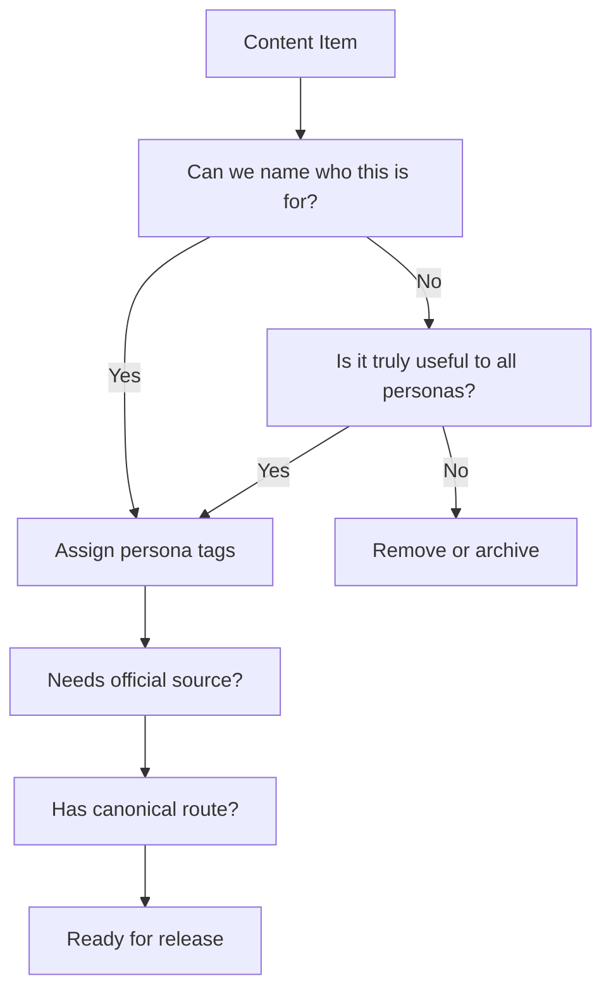

# Persona Content Mapping

Date: 2026-06-16
Owner: Content / IA
Status: Target content model and audit plan

## Purpose

Every content item must answer:

Who is this for?

If a content item has no persona, it must be assigned one, marked universal, or removed.

## Required Metadata

Every content item receives structured tags:

```swift
enum PersonaTag: String, Codable, CaseIterable, Hashable {
    case student
    case worker
    case refugee
    case family
    case tourist
    case entrepreneur
    case lgbt
    case eu
    case nonEU
    case highlySkilledMigrant
    case universal
}
```

Recommended addition to `KnowledgeItem`:

```swift
let personaTags: Set<PersonaTag>
let excludedPersonaTags: Set<PersonaTag>
let primaryPersonaTag: PersonaTag?
let contentRisk: ContentRisk
```

Recommended risk model:

```swift
enum ContentRisk: String, Codable, Hashable {
    case low
    case medium
    case officialSourceRecommended
    case officialSourceRequired
    case emergency
}
```

## Visibility Rules

| Rule | Behavior |
|---|---|
| Active persona match | Show by default |
| Universal plus relevant task | Show by default |
| Secondary context match | Show in related widgets |
| Excluded persona match | Hide by default |
| No tag | Block from release until audited |
| Search override | Show with "outside your path" note |
| Official-source-required | Show official source and review date |

## Persona Content Matrix

| Content Area | Student | Worker | Refugee | Highly Skilled Migrant | EU Citizen | Family | Tourist | Entrepreneur | LGBT Newcomer |
|---|---|---|---|---|---|---|---|---|---|
| Universities | Primary | Hide | Related only | Hide | Related only | Related only | Hide | Hide | Contextual |
| MBO | Primary | Hide | Education access | Hide | Related only | Family child path | Hide | Hide | Contextual |
| HBO | Primary | Hide | Education access | Hide | Related only | Family child path | Hide | Hide | Contextual |
| Research Universities | Primary | Hide | Education access | Related only | Related only | Related only | Hide | Hide | Contextual |
| DUO | Primary | Hide | Education access only | Hide | Student context only | Child/student context | Hide | Hide | Student context |
| Student Housing | Primary | Hide | Hide | Hide | Student context | Hide | Hide | Hide | Student context |
| Student Finance | Primary | Hide | Education access only | Hide | Student context | Child/student context | Hide | Hide | Student context |
| Student Insurance | Primary | Hide | Hide | Hide | Student context | Hide | Hide | Hide | Student context |
| Public Transport Discounts | Primary | Related | Related | Related | Related | Related | Tourist transport only | Related | Contextual |
| Dutch Language Courses | Primary | Related | Primary | Related | Related | Family support | Hide by default | Related | Contextual |
| Student Jobs | Primary | Hide | Work permission dependent | Hide | Student context | Hide | Hide | Hide | Student context |
| Libraries | Primary | Related | Related | Related | Related | Family activities | Tourist city only | Related | Community context |
| Student Communities | Primary | Hide | Hide | Hide | Student context | Hide | Hide | Hide | Student context |
| Student Events | Primary | Hide | Hide | Hide | Student context | Hide | Hide | Hide | Student context |
| Study Spaces | Primary | Hide | Education access | Hide | Student context | Family child/student | Hide | Hide | Student context |
| City Life | Primary | Related | Related | Related | Related | Related | Primary | Related | Contextual |
| Free Time | Primary | Hide | Related | Hide | Related | Primary | Primary | Hide | Community context |
| BSN | Setup | Primary | Primary | Primary | Primary | Primary | Hide | Primary | Contextual |
| DigiD | Setup | Primary | Primary | Primary | Primary | Primary | Hide | Primary | Contextual |
| Work Contracts | Hide | Primary | Work permission only | Primary | Worker context | Hide | Hide | Entrepreneur contracts only | Contextual |
| Taxes | Hide by default | Primary | Benefits/tax letters only | Primary | Primary | Benefits/tax letters | Hide | Primary | Contextual |
| UWV | Hide | Primary | Related only | Hide | Worker context | Hide | Hide | Hide | Contextual |
| Salary | Hide | Primary | Work permission only | Primary | Worker context | Hide | Hide | Business income only | Contextual |
| Employment Rights | Student job only | Primary | Work permission only | Primary | Worker context | Hide | Hide | Self-employed rights | Contextual |
| Health Insurance | Primary | Primary | Primary | Primary | Primary | Primary | Travel health only | Primary | Primary |
| Housing | Student housing | Primary | Primary | Primary | Primary | Primary | Accommodation only | Primary | Safety context |
| Transport | Primary | Primary | Related | Primary | Primary | Family transport | Primary | Primary | Contextual |
| Pension | Hide | Primary | Hide | Primary | Worker context | Hide | Hide | Self-employed pension only | Contextual |
| Worker Training | Hide | Primary | Work access only | Related | Worker context | Hide | Hide | Business training | Contextual |
| IND | Non-EU student only | Non-EU worker only | Primary | Primary | Hide by default | Contextual | Visa only | Startup visa context | Contextual |
| Municipality | Setup | Setup | Primary | Setup | Primary | Primary | Emergency/city only | Business permits | Contextual |
| Benefits | Hide | Related only | Primary | Hide | Contextual | Primary | Hide | Hide | Contextual |
| Integration | Hide | Hide | Primary | Hide | Hide | Contextual | Hide | Hide | Contextual |
| Documents | Setup | Primary | Primary | Primary | Primary | Primary | Lost documents only | Primary | Contextual |
| Work Permissions | Hide | Non-EU context | Primary | Sponsor context | Hide | Contextual | Hide | Startup/self-employed context | Contextual |
| Education Access | Primary | Hide | Primary | Hide | Student context | Child/student context | Hide | Hide | Contextual |
| Support Organizations | Related | Related | Primary | Related | Related | Related | Emergency only | Related | Primary |
| Schools | Hide | Hide | Related | Family context | Family context | Primary | Hide | Hide | Family context |
| Childcare | Hide | Hide | Related | Family context | Family context | Primary | Hide | Hide | Family context |
| Kinderopvang | Hide | Hide | Related | Family context | Family context | Primary | Hide | Hide | Family context |
| SVB | Hide | Hide | Related | Family context | Family context | Primary | Hide | Hide | Family context |
| Child Benefits | Hide | Hide | Related | Family context | Family context | Primary | Hide | Hide | Family context |
| Family Housing | Hide | Hide | Related | Family context | Family context | Primary | Hide | Hide | Family context |
| Activities | Related | Hide | Related | Family context | Family context | Primary | Primary | Hide | Community context |
| Municipal Services | Setup | Related | Primary | Setup | Primary | Primary | City help only | Business permits | Contextual |
| KvK | Hide | Hide | Hide | Hide | Entrepreneur context | Hide | Hide | Primary | Contextual |
| VAT / BTW | Hide | Hide | Hide | Hide | Entrepreneur context | Hide | Hide | Primary | Contextual |
| Business Permits | Hide | Hide | Hide | Hide | Entrepreneur context | Hide | Hide | Primary | Contextual |
| LGBT Safety | Contextual | Contextual | Contextual | Contextual | Contextual | Contextual | Contextual | Contextual | Primary |
| LGBT Healthcare | Contextual | Contextual | Contextual | Contextual | Contextual | Contextual | Contextual | Contextual | Primary |
| LGBT Community | Contextual | Contextual | Contextual | Contextual | Contextual | Contextual | Contextual | Contextual | Primary |

## Current Content Sources To Audit

Existing code inventory shows these content pools should receive persona tags:

| Source | Current Shape | Required Persona Action |
|---|---|---|
| `GuideContent.sections` | Topic sections and articles | Tag every section and article |
| `MockChecklistData.items` | Checklist tasks | Tag every checklist item |
| `MockExpansionData.knowledgeTopics` | AI knowledge topics | Tag every topic |
| `MockExpansionData.lifeScenarios` | Scenario content | Tag every scenario |
| `officialServices()` in `KnowledgeIndexBuilder` | Institutions/sources | Tag by persona relevance |
| `documents()` | Document guidance | Tag by setup path |
| `fines()` / `rules()` | Rules and fines | Mostly universal plus tourist/worker/student modifiers |
| `institutions()` | Institution directory | Tag IND/DUO/UWV/SVB/KvK by persona |
| `lgbtqSupport()` | Support items | Tag `lgbt` plus secondary personas |
| `resources()` | General resources | Tag or remove generic items |
| `nearbyPlaces()` | Map places | Tag by persona-relevant service |
| `knmModules()` | KNM/integration | Refugee/integration primary, contextual elsewhere |
| `dutchCourseModules()` | Language course | Student/refugee/worker/family/contextual |
| `searchAnswers()` | Search quick answers | Tag and filter before display |

## Content Audit Workflow

For every item:

1. Identify the primary persona.
2. Add secondary personas only where genuinely useful.
3. Add EU/non-EU modifier when legal route changes.
4. Add `universal` only if every persona benefits from seeing it.
5. Add excluded personas when content is actively confusing.
6. Confirm official source requirement.
7. Confirm route owner.
8. Confirm whether the item belongs on a dashboard, search result, AI answer, or full library only.

## Audit Decision Tree



## Default Persona Tag Rules

Student:

- Include DUO, study, student housing, student jobs, student finance, student transport, student insurance, libraries, student life.
- Exclude worker-only tax detail, refugee status flows, UWV-first routes.

Worker:

- Include BSN, DigiD, contracts, salary, rights, taxes, health insurance, housing, transport, pension, training.
- Exclude student finance, student communities, refugee procedures.

Refugee:

- Include IND, municipality, documents, support, healthcare, housing, benefits, integration, language, work permission, education access.
- Exclude student-only and worker-only content unless required by selected subpath.

Family:

- Include schools, childcare, SVB, child benefits, family housing, healthcare, activities, municipality.
- Exclude single-person student/worker content by default.

Tourist:

- Include emergency, travel health, transport, fines, city essentials, lost documents, stay rules.
- Exclude BSN/DigiD/work/benefits by default.

Entrepreneur:

- Include KvK, BTW/VAT, taxes, banking, permits, contracts, insurance, startup visa.
- Exclude employee worker paths unless explicitly comparing.

LGBT:

- Include safety, rights, healthcare, mental health, community, legal support, housing safety.
- Can be primary or secondary.

EU:

- Include registration, BSN, DigiD, work rights, healthcare, housing, tax.
- Exclude IND residence permit as default.

Non-EU:

- Include IND, permit, sponsor, work permission, residence route, study route when relevant.

Highly Skilled Migrant:

- Include IND sponsor, salary, 30% ruling, family relocation, BSN/DigiD, housing, insurance.

## Release Blockers

- Any visible content item without persona metadata.
- Any student dashboard showing worker/refugee content by default.
- Any worker dashboard showing DUO/student-life content by default.
- Any refugee dashboard showing unrelated student/worker/tourist modules by default.
- AI returning cross-persona results without explanation.
- Search ranking another persona's content above active-persona content.

## Migration Recommendation

Phase 1:

- Add persona tags to data models.
- Hard-code initial tag mapping in `KnowledgeIndexBuilder`.
- Filter AI/search/Home based on active persona.

Phase 2:

- Move tags into source content data.
- Add content audit tooling that fails on missing tags.
- Add tests for student, worker, refugee, and family isolation.

Phase 3:

- Add secondary persona contexts.
- Add "search all topics" override.
- Add editorial dashboard for unaudited content.
