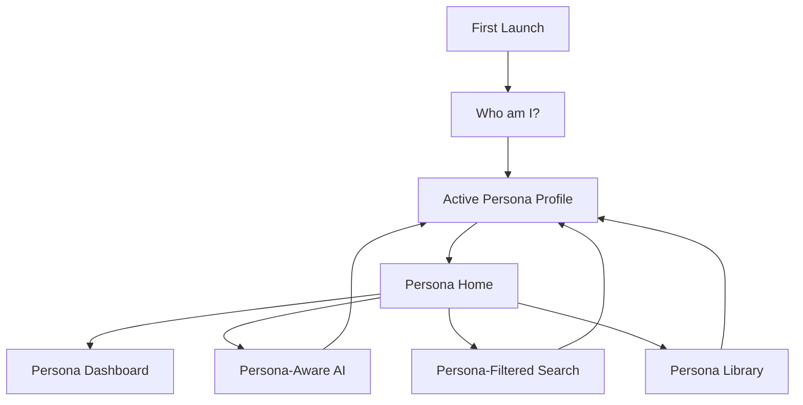

# Persona-First Information Architecture

Date: 2026-06-16
Owner: Product / Information Architecture
Status: Target architecture

## Mission

YouNew must stop behaving like a document library grouped by topic. It must become a guided life assistant that first asks:

Who am I?

Only after the user chooses a life path should the app show topics, tasks, search results, AI answers, recommendations, and official sources.

## Core Rule

Persona comes before topic.

The primary navigation decision is not "Housing, Work, Education, Government." The primary decision is "Student, Worker, Refugee, Family, Tourist, Entrepreneur, LGBT newcomer, EU citizen, Highly Skilled Migrant."

Every major surface must be filtered by the active persona:

- Home
- Dashboard widgets
- Search
- AI assistant
- Recommendations
- Saved item suggestions
- Checklist
- Content library
- Official source shortcuts
- Map categories

## Persona Set

| Persona ID | User-Facing Label | Primary Need | Existing Model Match | Required Change |
|---|---|---|---|---|
| `student` | Student | Study, DUO, housing, insurance, student life | `UserStatus.student` | Keep and expand |
| `worker` | Worker | BSN, contracts, salary, taxes, rights | `UserStatus.worker` | Keep and narrow |
| `refugee` | Refugee | IND, municipality, housing, benefits, integration | `UserStatus.refugee` plus `ukrainian` | Keep refugee; treat Ukrainian as legal context, not separate IA root unless needed |
| `highlySkilledMigrant` | Highly Skilled Migrant | Sponsor, IND, 30% ruling, relocation, family | `UserStatus.expat` / `ProfileType.expat` | Rename from broad expat where possible |
| `euCitizen` | EU Citizen | Registration, work, healthcare, housing, rights | Missing | Add as first-class persona |
| `family` | Family | Schools, childcare, benefits, healthcare, housing | `UserStatus.family` | Keep and expand |
| `tourist` | Tourist | Emergency, transport, stay rules, healthcare access | `UserStatus.tourist` | Keep and simplify |
| `entrepreneur` | Entrepreneur | KvK, taxes, permits, banking, insurance | Missing | Add as first-class persona |
| `lgbtNewcomer` | LGBT Newcomer | Safety, support, healthcare, community, rights | `LGBTQSupportView` only | Promote from support topic to optional persona/path |

## Required App Shape

## Home Architecture

Home is not a general hub. Home is a persona dashboard.

Each home must contain:

- Persona title and current status
- Top next actions
- Documents needed for that persona
- Official institutions for that persona
- Urgent warnings for that persona
- Recommended places or services for that persona
- AI prompt seeded with that persona
- Optional switch profile action

Home must not contain:

- Full topic library
- Cross-persona education
- Worker tax complexity for students
- Student DUO information for workers
- Refugee bureaucracy for tourists
- Generic content blocks that ignore the active profile

## Persona Dashboards

### Student Dashboard

Allowed content:

- Universities
- MBO
- HBO
- Research Universities
- DUO
- Student Housing
- Student Finance
- Student Insurance
- Public Transport Discounts
- Dutch Language Courses
- Student Jobs
- Libraries
- Student Communities
- Student Events
- Study Spaces
- City Life
- Free Time

Excluded content:

- Tax complexity
- Worker reintegration
- Refugee bureaucracy
- UWV unless explicitly searched
- 30% ruling unless a secondary profile says highly skilled migrant

Primary widgets:

- Enrollment and registration
- DUO and finance
- Student housing
- Insurance
- Transport discounts
- Study and city life
- Student work

### Worker Dashboard

Allowed content:

- BSN
- DigiD
- Work Contracts
- Taxes
- UWV
- Salary
- Employment Rights
- Health Insurance
- Housing
- Transport
- Pension
- Worker Training

Excluded content:

- DUO student finance
- Student communities and study spaces
- Refugee status processes
- Tourist attractions as main actions

Primary widgets:

- Start work legally
- Contract and salary
- Tax and DigiD
- Health insurance
- Housing and commute
- Employment rights

### Refugee Dashboard

Allowed content:

- IND
- Municipality
- Housing
- Benefits
- Integration
- Language
- Healthcare
- Documents
- Work Permissions
- Education Access
- Support Organizations

Excluded content:

- Student-only DUO flows unless education access is selected
- Worker tax optimization
- Tourist content
- Highly skilled migrant sponsor content

Primary widgets:

- Status and documents
- Municipality next steps
- Housing and benefits
- Healthcare
- Integration and language
- Work permission
- Support organizations

### Highly Skilled Migrant Dashboard

Allowed content:

- IND
- Recognized sponsor
- Residence permit
- BSN
- DigiD
- 30% ruling
- Salary requirements
- Housing
- Health insurance
- Family relocation
- Tax basics
- Banking
- International schools when family context exists

Excluded content:

- Refugee benefits
- Student-only DUO content
- Tourist-only content
- Generic worker training unless explicitly searched

Primary widgets:

- Sponsor and IND
- BSN and DigiD
- Salary and 30% ruling
- Housing and insurance
- Family relocation

### EU Citizen Dashboard

Allowed content:

- Registration
- BSN
- DigiD
- Work rights
- Healthcare
- Housing
- Taxes
- Transport
- Banking
- Family registration
- Municipality services

Excluded content:

- IND residence permit as a default first action
- Refugee support flows
- Student finance unless student context exists

Primary widgets:

- Register with municipality
- BSN and DigiD
- Work and healthcare
- Housing
- Tax basics

### Family Dashboard

Allowed content:

- Schools
- Childcare
- Kinderopvang
- SVB
- Child Benefits
- Family Housing
- Healthcare
- Activities
- Municipal Services

Excluded content:

- Student-only higher education unless a family member is a student
- Worker-only salary and contract detail unless selected
- Refugee-specific bureaucracy unless the family profile includes refugee status

Primary widgets:

- Register family
- School and childcare
- Benefits and SVB
- Family healthcare
- Housing
- Activities nearby

### Tourist Dashboard

Allowed content:

- Emergency
- Travel health insurance
- Transport
- Fines and rules
- Accommodation
- Visa or allowed stay
- City essentials
- Attractions
- Lost documents
- Embassy and consular help

Excluded content:

- BSN/DigiD as default
- Work contracts
- DUO
- Long-term housing
- Dutch benefits

Primary widgets:

- Stay rules
- Emergency help
- Transport
- City essentials
- Lost documents

### Entrepreneur Dashboard

Allowed content:

- KvK
- Business registration
- VAT / BTW
- Income tax
- Banking
- Insurance
- Permits
- Contracts
- Self-employment rights
- Startup visa where relevant
- Municipality business rules

Excluded content:

- Student life
- Refugee-only support unless secondary context exists
- Worker employee contracts as default

Primary widgets:

- Start a business
- KvK and tax
- Banking and insurance
- Permits
- Contracts

### LGBT Newcomer Dashboard

Allowed content:

- Safety
- Rights
- Healthcare
- Mental health
- Community organizations
- Legal support
- Housing safety
- Student LGBT support when student context exists
- Refugee LGBT support when refugee context exists
- Events and community spaces

Excluded content:

- Generic bureaucracy as the first experience
- Irrelevant student/worker/refugee content unless paired with the user's main life path

Primary widgets:

- Safe support
- Healthcare and mental health
- Rights and legal help
- Community
- Emergency safety

## Navigation Model

Primary navigation after onboarding:

| Tab | Persona-First Role |
|---|---|
| Home | Active persona dashboard |
| Search | Persona-filtered search with optional "search all" override |
| Map | Persona-relevant services nearby |
| Saved | Saved items grouped by persona/task |
| AI Assistant | AI with active persona context |
| More | Persona library first, full library second |

More should show:

1. Current persona path
2. Related paths
3. Switch profile
4. Full library behind an explicit "All topics" entry

## Content Visibility Rules

Default visibility:

- Show content tagged with the active persona.
- Show universal content only if it is useful to the active persona.
- Hide content that belongs only to another persona.
- Allow explicit search override only after showing a note: "This is outside your current path."

Cross-persona content may appear only when:

- User manually searches for it.
- User adds a secondary context.
- The item is required by a legal dependency.
- AI explains why the item is relevant.

## Existing Architecture Gap

Current app status:

- `UserStatus` supports refugee, Ukrainian, student, worker, expat, family, tourist.
- `ProfileBlueprint` already provides priorities, documents, institutions, legal topics, warnings, onboarding flow, and checklist keyword filters.
- `KnowledgeItem` has category, keywords, route, sources, safety level, and source path.
- `AIContext` has `userSituation`, route, screen, city, province, saved items, checklist progress, and guide progress.

Required additions:

- Add `PersonaTag` as structured metadata.
- Expand statuses to include `euCitizen`, `entrepreneur`, `highlySkilledMigrant`, `lgbtNewcomer`.
- Replace broad `expat` wording with `highlySkilledMigrant` where legally appropriate.
- Add persona tags to every `KnowledgeItem`.
- Add active persona to `AIContext`.
- Filter search by active persona before ranking.
- Make Home render persona-specific widget sets.

## Acceptance Criteria

- First launch asks "Who am I?"
- Every persona has a dashboard.
- Student never sees worker/refugee complexity by default.
- Worker never sees student-only content by default.
- Refugee never sees tourist/student/worker-only content by default.
- Family sees child and household content first.
- Search respects persona tags.
- AI respects persona tags.
- Content without persona ownership is audited, tagged, or removed.
- The full library remains available, but it is never the default first experience.
