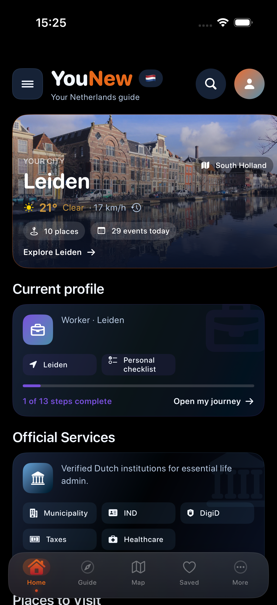
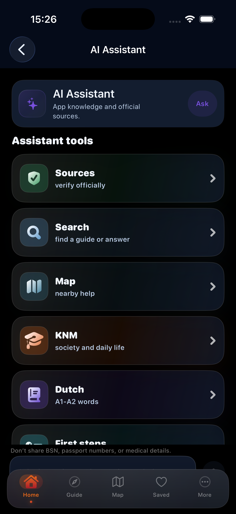
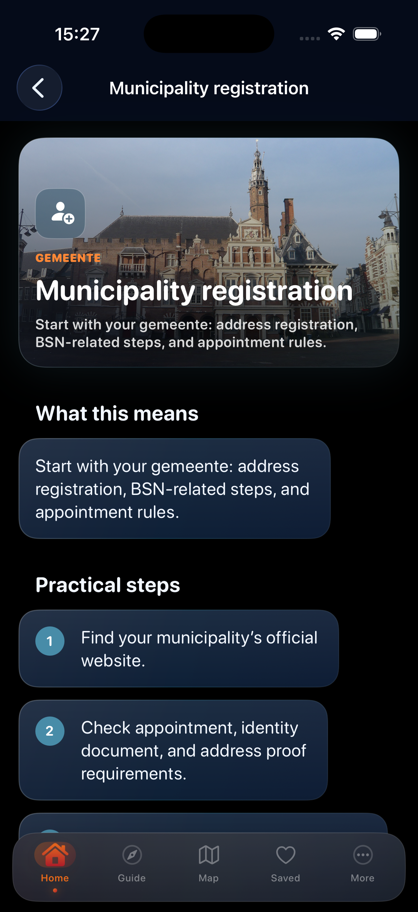
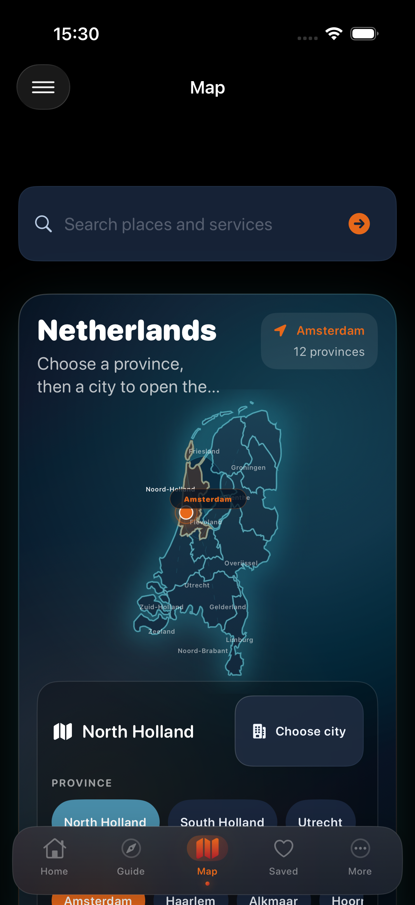

# YouNew

[](https://github.com/zq87xf5jyp-arch/YouNew/actions/workflows/product-ci.yml)
[](https://github.com/zq87xf5jyp-arch/YouNew/actions/workflows/data-project-health.yml)
[](https://github.com/zq87xf5jyp-arch/YouNew/actions/workflows/secret-scan.yml)

[Website](https://younew.nl) ·
[App Store](https://apps.apple.com/app/id6782617312) ·
[Support](https://younew.nl/support/)

[Repository governance](docs/REPOSITORY_GOVERNANCE.md) documents protected
`main`, short-lived branches, required pull-request checks, verified backups, and
the release journal.

**A local-first iOS guide that turns a newcomer's practical question into an
ordered next step, relevant in-app guidance, and a named official source.**

YouNew is built in SwiftUI for people starting a life in the Netherlands. The
Build Week candidate demonstrates one bounded, reproducible journey without an
API key or deployed backend.

> **Release status:** YouNew 1.0 is publicly available on the App Store. The
> committed `main` branch contains the next 1.1 source candidate and remains
> subject to release validation. YouNew is not a government service and does not
> claim a verified live-LLM runtime.

[Build Week overview](BuildWeek/README_BUILD_WEEK.md) ·
[2:20 demo guide](BuildWeek/DEMO_GUIDE.md) ·
[How Codex was used](BuildWeekSubmission/HOW_CODEX_WAS_USED.md) ·
[Known limitations](BuildWeekSubmission/KNOWN_LIMITATIONS.md)

## Product preview

| Home | Local guided assistant |
|---|---|
|  |  |

| Newcomer next steps | Interactive Netherlands map |
|---|---|
|  |  |

These screenshots are part of the bounded submission media set. The map is a
simplified YouNew visualization, not an official government map. Photograph
credits and license terms are recorded in
[Media rights and attribution](BuildWeekSubmission/MEDIA_RIGHTS_AND_ATTRIBUTION.md).

## Why YouNew

New residents often need to coordinate municipal registration, BSN, DigiD,
healthcare, housing, transport, work, study, and local services. The hard part is
not finding one webpage; it is understanding prerequisites, sequence, and which
official action comes next.

YouNew brings those tasks into one navigable iOS experience:

- structured newcomer journeys and practical guides;
- a deterministic local guided assistant;
- typed routes from guidance into relevant app content;
- stored official-source actions and verification context;
- search, saved items, checklists, city discovery, and local utilities;
- an interactive Netherlands map; and
- a governed content and import model.

## Build Week demo

The bounded candidate flow uses functionality already implemented and verified in
the app:

1. Start on Home and open **Open AI assistant**.
2. Ask **How do I get BSN?**.
3. Choose **Yes, fixed address**, then **Yes, include DigiD**.
4. Show the **Local guide mode** response, open the BSN guide, and show one named
   official-source action.
5. Open Map, return to Home with one root-tab tap, then open Amsterdam through
   the stable Map/Home route.

Do not use the Assistant **Open Leiden** shortcut or the long Guide-to-Transport
composite path; both remain reproducible failures outside the bounded demo. The
exact sequence, wording, fallbacks, and recording checklist are in
[BuildWeekSubmission/DEMO_GUIDE.md](BuildWeekSubmission/DEMO_GUIDE.md).

## Truthful AI positioning

The demonstrated assistant is local and deterministic. `AIWorkflowEngine`
selects a bounded workflow, `KnowledgeIndex` and `ContentRepository` provide
structured YouNew knowledge, and `AIResponseComposer` builds sections, warnings,
next steps, routes, and source actions.

The demo needs no backend or API key. Optional backend example code exists, but
it is not deployed evidence and is not part of the candidate claim. Do not
describe YouNew as using live OpenAI or GPT-5.6 inference.

OpenAI Codex supported implementation, debugging, stabilization, technical
auditing, and Build Week packaging under human direction. See
[BuildWeek/HOW_CODEX_HELPED.md](BuildWeek/HOW_CODEX_HELPED.md).

The owner describes ChatGPT as a product and writing partner for shaping the
problem, journeys, content, and public story. This creator collaboration is
separate from the in-app assistant runtime. See
[BuildWeek/HOW_CHATGPT_HELPED.md](BuildWeek/HOW_CHATGPT_HELPED.md).

## Candidate features

- Native SwiftUI interface with typed root and feature navigation
- Local BSN, DigiD, health, housing, letter/fine, and next-step workflows
- Indexed content lookup with explicit source actions
- Interactive SwiftUI map with province and city navigation
- Governed `cities-v0.1.0` release for Amsterdam, Rotterdam, Den Haag, Utrecht,
  and Eindhoven
- Premium image pipeline with local/remote candidates, fallbacks, downsampling,
  bounded caches, and accessibility labels
- Saved items, checklists, search, city discovery, and newcomer guides
- Governed JSON content, schema, release, and deterministic import tooling

The detailed implemented scope is in [BuildWeek/FEATURES.md](BuildWeek/FEATURES.md).

## Architecture

```text
SwiftUI screens
    ↓
RootTabView + typed AppDestination routes
    ↓
Feature view models and services
    ↓
ContentRepository / KnowledgeIndex / workflow engines
    ↓
Bundled Swift content + governed runtime JSON
```

The project uses a pragmatic SwiftUI architecture with environment-provided
shared state, typed destinations, repositories, feature services, and local
persistence. See
[BuildWeek/TECHNICAL_OVERVIEW.md](BuildWeek/TECHNICAL_OVERVIEW.md).

## Project facts

| Item | Value |
|---|---|
| Platform | Native iOS |
| Language and UI | Swift 5, SwiftUI |
| Bundle identifier | `nl.younew.app` |
| Public App Store release | 1.0 (published 2026-06-24) |
| Local source candidate | 1.1 (7) |
| Minimum deployment target | iOS 17.6 |
| Demonstrated assistant | Local deterministic guide |
| Backend required for demo | No |

## Repository structure

| Path | Purpose |
|---|---|
| `YouNew/` | iOS application source, resources, content, and UI |
| `YouNewTests/` | unit and local integration coverage |
| `YouNewUITests/` | runtime navigation and demo contracts |
| `DataProject/` | governed content source, schema, releases, and import model |
| `scripts/` | static, data, media, and release checks |
| `BackendExamples/` | optional backend reference outside the demo claim |
| `BuildWeek/` | final Build Week narrative, demo, and submission package |
| `BuildWeekFinal/` | preserved targeted remediation evidence |

## Run locally

Requirements:

- macOS with a compatible Xcode version;
- an iOS runtime supported by the project;
- no backend or provider credential for the documented demo.

Open `YouNew.xcodeproj`, select the shared `YouNew` scheme, choose a compatible
iPhone destination, and Run.

For a command-line Debug build, select an installed destination appropriate to
your Xcode environment:

```sh
xcodebuild \
  -project YouNew.xcodeproj \
  -scheme YouNew \
  -configuration Debug \
  -destination 'platform=iOS Simulator,name=<AVAILABLE_IPHONE>' \
  build \
  CODE_SIGNING_ALLOWED=NO
```

The documented local assistant path requires no environment variable. Never add
an OpenAI key to Swift source, the application bundle, Xcode settings, fixtures,
or screenshots.

## Readiness evidence

This README separates preserved Build Week evidence from current automated
health evidence; neither is a universal security or release certification.

- The 22 July 2026 production audit records an unsigned generic iOS Release
  build and 461/461 unit tests passing. It also records unresolved production,
  privacy, content, legal, operations and distribution blockers; see the
  [production-readiness audit](PRODUCTION_READINESS_AUDIT_2026-07-22.md).
- The current complete UI audit ran 87 tests on an iPhone 17 Pro Simulator:
  80 passed and 7 failed. Clean targeted reruns confirm the guide-layout fix,
  but the BSN/Leiden assistant route remains broken and first-tab latency is
  variable (204.2 ms in a targeted rerun and 442.3 ms in the complete run,
  against a 100 ms gate). This evidence is a release failure, not a waiver.
- The preserved Build Week candidate had a successful clean Debug simulator
  build and a 460/460 unit-test artifact.
- The targeted Map ↔ Home fix records 3/3 targeted checks; the isolated final
  transition gate records 10/10 first-tap transitions.
- Two preserved 100-tap map calibration runs produced 99/100 followed by an
  unchanged 100/100 repeat; the first failure remains disclosed.
- Targeted evidence also covers the Guide loading state and shared search-field
  hit testing.
- Structural validation covers the governed five-city content release.
- The preserved Build Week snapshot recorded 43/44 static checks and 18 broken
  external URLs. After source remediation, the current
  [DATA PROJECT Health run #6](https://github.com/zq87xf5jyp-arch/YouNew/actions/runs/29904201000)
  checked 2,488 URLs, reports `confirmed_broken=0`, and passes the enforced Data
  Health gate.
- Eight simulator screens passed the preserved Build Week visual smoke
  inspection. That historical full UI suite was 79/87; the isolated rerun of
  those eight failures was 5/8.
- Three UI failures remained reproducible in that historical evidence: Guide scroll/UI-query at Transport,
  root-tab latency above 100 ms, and the Assistant selected-city shortcut.

See [BuildWeekSubmission/FINAL_VALIDATION.md](BuildWeekSubmission/FINAL_VALIDATION.md)
for the decision, [BuildWeekFinal/GLITCH_READINESS.md](BuildWeekFinal/GLITCH_READINESS.md)
for the 84/100 candidate rubric, and
[BuildWeekSubmission/KNOWN_LIMITATIONS.md](BuildWeekSubmission/KNOWN_LIMITATIONS.md)
for the evidence boundary.

## Privacy, safety, and media

YouNew provides educational orientation, not professional or government advice.
Do not enter real BSNs, addresses, health details, account data, documents, or
credentials into a demo.

The image system is implemented, and the Build Week demo has a narrow
source-backed media allowlist. Repository-wide rights remain only partially
reconciled; historical captures are not automatically approved for public use.
See `PRIVACY.md`, `SECURITY.md`, `MEDIA_ATTRIBUTION.md`, and
[BuildWeekSubmission/MEDIA_RIGHTS_AND_ATTRIBUTION.md](BuildWeekSubmission/MEDIA_RIGHTS_AND_ATTRIBUTION.md)
for the detailed project records.

## Build Week package

Start with [BuildWeekSubmission/README_BUILD_WEEK.md](BuildWeekSubmission/README_BUILD_WEEK.md). It
links the project story, description, feature inventory, technical overview,
Codex/ChatGPT narratives, demo guide, Devpost copy, checklist, limitations,
owner actions, and final status.

The public repository is available at
[github.com/zq87xf5jyp-arch/YouNew](https://github.com/zq87xf5jyp-arch/YouNew).
The owner approved the reviewed 2:20 candidate and its exact SHA-256. The public
[Build Week demo](https://youtu.be/6YAxsAX7qdw) includes English captions and
the required media attribution.

## Contributing and support

- Read [CONTRIBUTING.md](CONTRIBUTING.md) before opening a pull request.
- Use the GitHub issue forms for reproducible bugs, feature requests, and
  official-source corrections. Never attach a BSN, identity document, address,
  medical record, credential, or other personal data.
- For ordinary support, visit [younew.nl/support](https://younew.nl/support/) or
  email [support@younew.nl](mailto:support@younew.nl). Report security issues by
  following [SECURITY.md](SECURITY.md), not through a public issue.

## License

This is an **evaluation-only source release**, not an open-source distribution.
See [LICENSE](LICENSE). Third-party content and media retain their respective
terms; repository inclusion does not grant redistribution rights.
