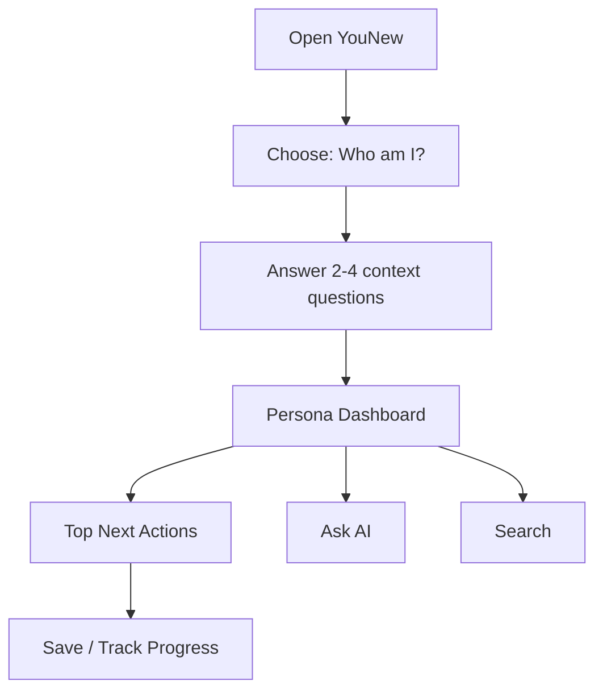

# Persona User Journeys

Date: 2026-06-16
Owner: Product / UX
Status: Target journey map

## Journey Principle

Every journey starts with identity, then immediate life actions, then deeper content.

The app should feel like:

1. I choose who I am.
2. The app shows what matters to me.
3. AI and search stay inside my path.
4. I can switch or add context when my situation changes.

## Global First-Run Journey

Required onboarding questions:

- Who am I?
- Am I already in the Netherlands?
- Which city or municipality matters to me?
- What is urgent right now?

Optional follow-up questions:

- EU or non-EU?
- Alone or with family?
- Study, work, protection, business, visit, or support?
- Do I already have BSN, DigiD, housing, and insurance?

## Student Journey

Goal: Make the student feel the app was built for students.

Entry:

- User selects Student.
- App asks study type if needed: MBO, HBO, Research University, Language, Exchange, Applying.
- App asks city or institution if known.

Dashboard widgets:

- Enrollment
- DUO and finance
- Student housing
- Student insurance
- Transport discounts
- Dutch language
- Student jobs
- Libraries and study spaces
- Communities and events
- City life and free time

Primary flow:

1. Confirm enrollment or application status.
2. Check municipality registration and BSN only as student setup.
3. Check DUO eligibility and deadlines.
4. Find housing and understand student rental risks.
5. Choose insurance path.
6. Set up transport discount or student travel product if eligible.
7. Explore language courses, student jobs, libraries, communities, and events.

Allowed content:

- Universities
- MBO
- HBO
- Research Universities
- DUO
- Student Housing
- Student Finance
- Student Insurance
- Public Transport Discounts
- Dutch Language Courses
- Student Jobs
- Libraries
- Student Communities
- Student Events
- Study Spaces
- City Life
- Free Time

Blocked by default:

- Tax complexity
- Worker reintegration
- Refugee bureaucracy
- UWV benefits as a primary action
- 30% ruling unless secondary highly skilled migrant context exists

AI behavior:

- Starts with DUO, study institution, housing, language, student work, and insurance.
- Does not begin with worker taxes, UWV, refugee procedures, or business setup.

## Worker Journey

Goal: Help a worker understand legal work, pay, taxes, insurance, and rights.

Entry:

- User selects Worker.
- App asks employed, seeking work, or temporary worker.
- App asks EU/non-EU if needed.

Dashboard widgets:

- BSN and DigiD
- Work contract
- Salary and payslip
- Taxes
- UWV
- Employment rights
- Health insurance
- Housing
- Transport
- Pension
- Worker training

Primary flow:

1. Confirm BSN and address registration.
2. Set up DigiD.
3. Review work contract basics.
4. Understand salary, payslip, holiday pay, and hours.
5. Check health insurance.
6. Understand tax basics and annual return.
7. Find employment rights and UWV when relevant.
8. Add pension and training content after core setup.

Allowed content:

- BSN
- DigiD
- Work Contracts
- Taxes
- UWV
- Salary
- Employment Rights
- Health Insurance
- Housing
- Transport
- Pension
- Worker Training

Blocked by default:

- DUO student finance
- Student communities
- Refugee asylum/status process
- Tourist travel content

AI behavior:

- Starts with BSN, DigiD, contract, salary, taxes, UWV, rights, and insurance.
- Does not suggest student-only or refugee-only flows unless requested.

## Refugee Journey

Goal: Reduce bureaucratic overload and guide the user through status, municipality, housing, support, and integration.

Entry:

- User selects Refugee.
- App asks whether the user is asylum seeker, status holder, temporary protection, or unsure.
- App asks municipality or current reception location if known.

Dashboard widgets:

- IND
- Municipality
- Housing
- Benefits
- Integration
- Language
- Healthcare
- Documents
- Work permission
- Education access
- Support organizations

Primary flow:

1. Identify current legal/status stage without forcing legal advice.
2. Show IND and municipality actions.
3. Organize documents and official letters.
4. Explain housing route and support options.
5. Explain benefits and healthcare.
6. Show integration and language actions.
7. Explain work permission and education access.
8. Connect to support organizations.

Allowed content:

- IND
- Municipality
- Housing
- Benefits
- Integration
- Language
- Healthcare
- Documents
- Work Permissions
- Education Access
- Support Organizations

Blocked by default:

- Student-only DUO setup unless education access is selected.
- Worker tax optimization.
- Highly skilled migrant sponsor details.
- Tourist attractions as first actions.

AI behavior:

- Starts with IND, municipality, housing, benefits, integration, language, healthcare, documents, and support.
- Uses official-source-required mode for immigration, benefits, work permission, and healthcare.

## Highly Skilled Migrant Journey

Goal: Give sponsored migrants a focused relocation, IND, salary, tax, and family setup path.

Entry:

- User selects Highly Skilled Migrant.
- App asks if the employer is a recognized sponsor.
- App asks whether family is relocating.

Dashboard widgets:

- IND and sponsor
- Residence permit
- BSN and DigiD
- Salary requirements
- 30% ruling
- Health insurance
- Housing
- Banking
- Family relocation
- Tax basics

Primary flow:

1. Check sponsor/IND route.
2. Register with municipality and get BSN.
3. Set up DigiD.
4. Understand salary, contract, and 30% ruling.
5. Arrange housing, banking, and health insurance.
6. Add family relocation and schools if needed.

AI behavior:

- Starts with IND, recognized sponsor, BSN, DigiD, salary, 30% ruling, housing, insurance, and family relocation.

## EU Citizen Journey

Goal: Make EU movers understand what they can do, what still needs registration, and what services matter.

Entry:

- User selects EU Citizen.
- App asks arrival timing and whether the user plans to work, study, live with family, or search for housing.

Dashboard widgets:

- Municipality registration
- BSN
- DigiD
- Work rights
- Healthcare
- Housing
- Taxes
- Banking
- Transport
- Family registration

Primary flow:

1. Register with municipality if staying long enough.
2. Get BSN.
3. Set up DigiD.
4. Understand work rights and healthcare.
5. Arrange housing, banking, and tax basics.
6. Add family or student/work subpath if relevant.

AI behavior:

- Starts with registration, BSN, DigiD, healthcare, housing, work rights, and taxes.
- Does not default to IND residence permit flows.

## Family Journey

Goal: Make family setup feel practical and calm.

Entry:

- User selects Family.
- App asks number/age range of children if the user chooses to provide it.
- App asks city or municipality.

Dashboard widgets:

- Schools
- Childcare
- Kinderopvang
- SVB
- Child benefits
- Family housing
- Healthcare
- Activities
- Municipal services

Primary flow:

1. Register address and family members.
2. Find schools and childcare.
3. Understand kinderopvang and child benefits.
4. Set up family healthcare.
5. Find family housing support.
6. Show municipal services and local activities.

AI behavior:

- Starts with schools, childcare, SVB, child benefits, family housing, healthcare, activities, and municipality.

## Tourist Journey

Goal: Help short-stay users avoid irrelevant long-term migration content.

Entry:

- User selects Tourist.
- App asks current city and length of stay.

Dashboard widgets:

- Emergency help
- Stay rules
- Transport
- Travel health insurance
- Lost documents
- Fines and rules
- City essentials
- Attractions

Primary flow:

1. Show emergency and healthcare access.
2. Explain transport and common fines.
3. Show city essentials and safe official help.
4. Help with lost documents or consular support if needed.

AI behavior:

- Does not suggest BSN, DigiD, housing contracts, DUO, UWV, or benefits by default.

## Entrepreneur Journey

Goal: Help self-employed and founders navigate business setup.

Entry:

- User selects Entrepreneur.
- App asks self-employed, startup, freelancer, or company founder.
- App asks EU/non-EU if relevant.

Dashboard widgets:

- KvK
- Business registration
- VAT / BTW
- Income tax
- Banking
- Insurance
- Permits
- Contracts
- Startup visa
- Municipality business rules

Primary flow:

1. Choose business type.
2. Register or prepare KvK route.
3. Understand tax and VAT obligations.
4. Set up banking and insurance.
5. Check permits and municipality rules.
6. Add startup visa or residence route when relevant.

AI behavior:

- Starts with KvK, tax, VAT, business registration, permits, banking, and insurance.

## LGBT Newcomer Journey

Goal: Provide a safe, private, support-first path that can stand alone or combine with another persona.

Entry:

- User selects LGBT Newcomer or adds it as a secondary context.
- App avoids forcing disclosure beyond the selected path.

Dashboard widgets:

- Safe support
- Rights
- Healthcare
- Mental health
- Community organizations
- Legal support
- Housing safety
- Events and spaces

Primary flow:

1. Show immediate safety and support.
2. Offer healthcare and mental health resources.
3. Explain rights and legal support.
4. Show community organizations and events.
5. Combine with student, refugee, worker, tourist, or family path when selected.

AI behavior:

- Uses a privacy-conscious tone.
- Does not expose this context in unrelated UI.
- Combines support with main life path only when needed.

## Return User Journey

When a user reopens the app:

1. Restore active persona.
2. Show persona dashboard immediately.
3. Surface unfinished next actions.
4. Keep AI seeded with the active persona.
5. Offer "Switch profile" without making it prominent enough to distract.

## Profile Switching Journey

Profile switching must support real life changes:

- Student starts working.
- Worker brings family.
- Refugee starts education.
- Tourist becomes resident.
- Highly skilled migrant adds family context.
- LGBT newcomer adds safety support to another path.

Rules:

- Keep one primary persona.
- Allow secondary contexts.
- Primary persona controls default home and search ranking.
- Secondary contexts add modules but do not replace the dashboard.

## Success Criteria

- The first screen after onboarding feels specific to the user.
- Each persona has a different home.
- Search results are filtered by persona.
- AI starts with the user's path.
- Cross-persona information is available only through explicit search, secondary context, or explained dependency.
