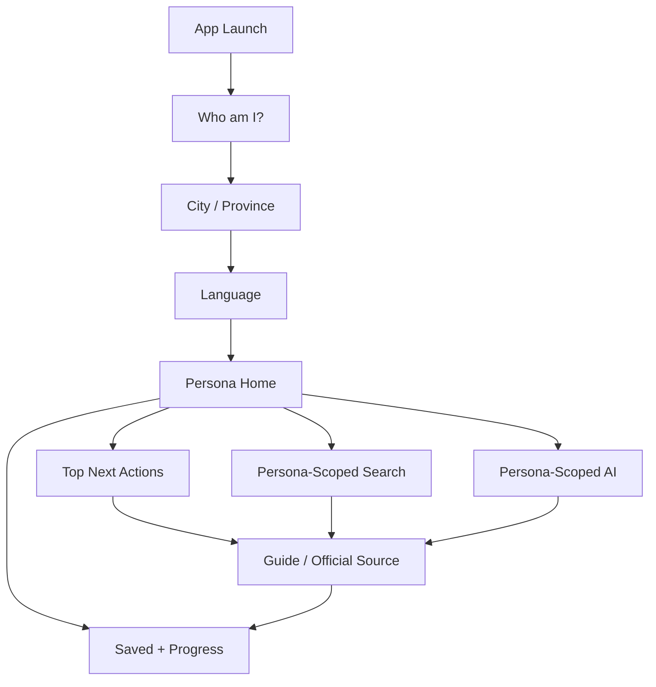

# USER JOURNEY MAP
## YouNew - Persona-Driven Life Journeys

Version: 4.0
Date: 2026-06-16
Owner: UX Architecture / Service Design / Information Architecture
Status: Canonical

---

## 1. Journey Principle

The user journey starts with identity.

```
Who am I? -> Where am I? -> What language do I need? -> What should I do next?
```

The app must never force a newcomer to understand Dutch bureaucracy before the app understands the newcomer.

---

## 2. Global Flow



---

## 3. Student Journey

Goal: help a student study, register, finance, live, and build a student life without worker/refugee/entrepreneur clutter.

### Ordered Journey

| Step | User Need | YouNew Surface |
|---|---|---|
| 1 | Register with municipality | Municipality Registration |
| 2 | Get BSN | BSN student guide |
| 3 | Activate DigiD | DigiD guide |
| 4 | Understand education type | Universities / HBO / MBO / Research Universities |
| 5 | Arrange money | DUO, Student Finance, Scholarships |
| 6 | Find housing | Student Housing, Room.nl-style sources |
| 7 | Arrange insurance | Student Insurance |
| 8 | Move around | Student Transport |
| 9 | Learn Dutch | Dutch Courses |
| 10 | Study well | Libraries, Study Spaces |
| 11 | Work carefully | Part-Time Jobs |
| 12 | Build life | Discounts, Communities, Events, Free Time, Sports, Culture, Nightlife |

Hidden: UWV reintegration, worker benefits, entrepreneur taxes, refugee procedures.

---

## 4. Worker Journey

Goal: help a worker start and continue work legally and confidently.

### Ordered Journey

| Step | User Need | YouNew Surface |
|---|---|---|
| 1 | Get citizen number | BSN worker guide |
| 2 | Access government services | DigiD |
| 3 | Understand job terms | Employment Contracts |
| 4 | Understand income | Salary and payslip |
| 5 | Handle taxes | Taxes |
| 6 | Know safety net | UWV |
| 7 | Arrange insurance | Health Insurance |
| 8 | Find a place to live | Housing |
| 9 | Commute | Transport |
| 10 | Understand long-term rights | Pension |
| 11 | Stay protected | Labor Rights |
| 12 | Grow | Training and Career Development |

Hidden: student finance, university guides, campus events, refugee asylum procedures.

---

## 5. Refugee Journey

Goal: help a refugee stabilize legal status, housing, benefits, healthcare, integration, education, work permissions, and support.

### Ordered Journey

| Step | User Need | YouNew Surface |
|---|---|---|
| 1 | Understand status | IND |
| 2 | Connect with local authority | Municipality |
| 3 | Stabilize living situation | Housing |
| 4 | Access income support | Benefits |
| 5 | Start integration | Integration |
| 6 | Get healthcare | Healthcare |
| 7 | Learn language | Language |
| 8 | Access school/study | Education Access |
| 9 | Understand work options | Work Permissions |
| 10 | Find trusted help | Support Organizations |
| 11 | Get rights support | Legal Help |

Hidden: tourist attractions, worker tax optimization, student nightlife, entrepreneur taxes.

Safety rule: immigration, asylum, benefits, and legal content must link to official or trusted support sources. AI must not act as a lawyer.

---

## 6. Family Journey

Goal: help a household settle children, care, health, housing, benefits, and local life.

### Ordered Journey

| Step | User Need | YouNew Surface |
|---|---|---|
| 1 | Register household | Municipality Services |
| 2 | Find school | Schools |
| 3 | Arrange care | Childcare / Kinderopvang |
| 4 | Understand child benefits | SVB / Child Benefits |
| 5 | Arrange family healthcare | Healthcare |
| 6 | Find suitable home | Family Housing |
| 7 | Build routine | Activities |

Hidden: student finance, tourist hotel feeds, entrepreneur-only taxes, unrelated worker career feeds.

---

## 7. Tourist Journey

Goal: help a visitor move around, enjoy the Netherlands, and stay safe.

### Ordered Journey

| Step | User Need | YouNew Surface |
|---|---|---|
| 1 | Choose where to go | Cities |
| 2 | Plan what to see | Attractions |
| 3 | Move around | Transport |
| 4 | Stay somewhere | Hotels |
| 5 | Find timely things | Events |
| 6 | Visit culture | Museums |
| 7 | Eat and drink | Food |
| 8 | Stay safe | Safety |
| 9 | Handle urgent issues | Emergency Numbers |

Hidden: DUO, UWV, SVB, IND residence procedures, BSN/DigiD setup, long-term housing, tax registration.

---

## 8. EU Citizen Journey

Goal: help an EU citizen register, work or live, and arrange daily setup.

Ordered journey: municipality registration, BSN, DigiD, health insurance, housing, work rights, taxes, transport, family add-ons if relevant.

---

## 9. Highly Skilled Migrant Journey

Goal: help a sponsored migrant understand IND, sponsor, salary threshold, 30% ruling, relocation, and family setup.

Ordered journey: recognized sponsor, IND permit, employment contract, BSN, DigiD, 30% ruling, housing, health insurance, family relocation if needed.

---

## 10. Entrepreneur Journey

Goal: help a founder or freelancer start and operate correctly.

Ordered journey: legal stay/work basis, KVK, business structure, VAT/BTW, income tax, permits, banking, insurance, municipality rules, workspace/network.

---

## 11. LGBT Newcomer Journey

Goal: help a user find safety, rights, community, healthcare, and discrimination support.

Ordered journey: immediate safety, rights, COC/support organizations, discrimination reporting, safe healthcare, mental health, community, legal help, housing safety.

---

## 12. Retired Person Journey

Goal: help an older newcomer arrange healthcare, pension, housing, local services, and daily support.

Ordered journey: registration, BSN/DigiD if needed, health insurance, GP/pharmacy, pension/AOW, tax basics, housing, transport, municipality services, social activities, emergency help.

---

## 13. Journey Acceptance Criteria

The journey map passes when:

- Each persona has a distinct first screen.
- Each first screen answers "what should I do next?"
- No journey begins with a generic category grid.
- Irrelevant persona content is hidden unless explicitly requested.
- Secondary persona modules are labeled and contained.
- Search and AI inherit the active persona automatically.
