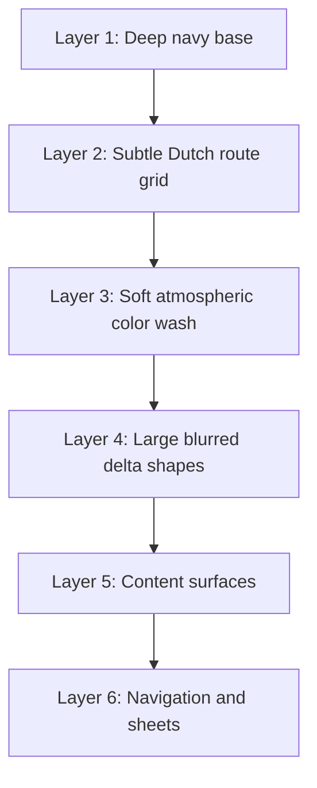

# Visual System Redesign

Date: 2026-06-13

Objective: make YouNew feel like one premium product instead of multiple screens assembled from separate visual systems.

## Before

The app had several competing background languages:

- Root shell used a Netherlands background.
- Screen modifiers used style-specific backgrounds for Home, Map, Province, City, Search, Saved, AI, More, Settings, Documents, Fines, Onboarding, and Support.
- AI Assistant and Onboarding had explicit local backgrounds.
- Older Dutch flag wave backgrounds remained in the codebase.
- Card styling included animated contour effects and stronger decorative overlays.
- Some screens bypassed the shared background with direct base colors.

The result was high risk of:

- visible seams between sections
- inconsistent gradients
- duplicated atmospheric layers
- background resets during navigation
- too much decorative noise behind content
- different emotional tone screen to screen

## After

The app now has one master background:

`GlobalBackgroundView`

Implemented in:

- `YouNew/Components/AppAtmosphereBackground.swift`

Used by:

- root app shell in `YouNew/NavigateNLApp.swift`
- `.appSceneBackground(_:)` in `YouNew/Resources/AppShadows.swift`
- AI Assistant
- Onboarding
- Home preview/root contexts
- navigation/sidebar surfaces

Compatibility wrappers remain:

- `AppAtmosphereBackground`
- `AppBackground`
- `NetherlandsBackground`
- `YouNewScreenBackground`

All compatibility wrappers now return `GlobalBackgroundView`, so old call sites cannot produce separate visual worlds.

## Concept

Name: Dutch Future

Tone:

- calm
- premium
- trustworthy
- intelligent
- European
- product-led rather than decorative

The background avoids flashy effects, harsh neon, disconnected shapes, and screen-specific mood changes.

## Layer Hierarchy

Runtime source:

- Layer 1: `DutchFutureBaseLayer`
- Layer 2: `DutchFutureGridLayer`
- Layer 3: `DutchFutureAtmosphereLayer`
- Layer 4: `DutchFutureShapeLayer`
- Vignette and grain: quiet finishing layers, disabled/reduced for accessibility transparency settings.

## Color System

Core surface tokens:

- Base: `AppSurface.base`
- Card: `AppSurface.card`
- Active card: `AppSurface.activeCard`
- Modal: `AppSurface.modal`
- Hairline: `AppSurface.hairline`

Primary accents:

- Dutch orange for action and warmth
- cyan for intelligence and guidance
- muted red and blue as national identity notes

Design rule:

Use accents as signals, not as full-screen themes. No section owns a separate background color family.

## Background System

Single source of truth:

- `GlobalBackgroundView` at `YouNew/Components/AppAtmosphereBackground.swift`

Routing rule:

- Screens may call `.appSceneBackground(.home)` or `.appSceneBackground(.map)` for semantic readability.
- The style parameter must not create a different background.
- All screen-level calls resolve to `GlobalBackgroundView`.

Removed or neutralized:

- old scene-specific layered background body
- route/map background overlay in photo heroes
- unused Dutch flag premium background
- unused onboarding flag premium background
- unused animated card contour overlay
- obsolete atmosphere and ambient motion layer structs

## Card System

Cards now use one quieter depth model:

- shared corner radius: `AppSurface.cardRadius`
- shared card fill: `AppSurface.cardSurface(accent:isActive:)`
- shared border: `AppSurface.cardBorder(accent:isActive:)`
- softened shadows from `AppShadows.card` and `AppShadows.elevatedCard`

Depth hierarchy:

| Level | Purpose | Token |
| --- | --- | --- |
| Background | The app world | `GlobalBackgroundView` |
| Surface | Page or grouped content | `AppSurface.e1` |
| Card | Standard information unit | `AppSurface.card` |
| Active Card | Selected or expanded unit | `AppSurface.activeCard` |
| Modal/Sheet | Highest content layer | `AppSurface.modal` |
| Navigation | Persistent control layer | `AppSurface.base.opacity(0.94)` plus material where needed |

## Navigation Hierarchy

Navigation now sits above the global world instead of creating its own world.

- Root app background: `GlobalBackgroundView`
- Navigation bar: `AppSurface.base.opacity(0.94)`
- Sidebar: `GlobalBackgroundView` plus subtle material overlay
- Tab bar remains the highest persistent control layer

## Screen Ownership

| Screen Group | Background Rule | Status |
| --- | --- | --- |
| Home | Global background only | PASS |
| Search | Global background only | PASS |
| Map | Global background behind map/content | PASS |
| Saved | Global background only | PASS |
| AI | Explicit global background | PASS |
| More | Global background plus navigation material | PASS |
| Province | Global background only | PASS |
| City | Global background only | PASS |
| History | Global background only | PASS |
| Guide/Journey/Help | Global background only | PASS |
| Settings | Global background plus unified nav bar | PASS |
| Onboarding | Explicit global background | PASS |

## Accessibility

Accessibility behavior:

- `GlobalBackgroundView` disables hit testing.
- `GlobalBackgroundView` is hidden from accessibility.
- Grain is removed when Reduce Transparency is enabled.
- Background remains dark and stable for OLED.
- Decorative layers do not sit above tappable content.

## Verification

Static verification:

- Swift type-check passed.
- Deprecated and duplicate screen-background symbols no longer appear in source search.
- No direct `AppColors.background.ignoresSafeArea()` route remains.

Runtime verification still required:

- Home to Search transition
- Search to Map transition
- Map to Province sheet
- Province to City detail
- Home to History
- Home to Transport
- More to Settings
- Onboarding to Home
- AI Assistant tab

Pass criteria for runtime:

- no background flashes
- no visible section seams
- no color jumps
- no conflicting full-screen gradients
- no decorative layer behind text that reduces readability
- no hit-testing from background layers

Current status: STATIC PASS, RUNTIME SCREENSHOT VERIFICATION PENDING.

