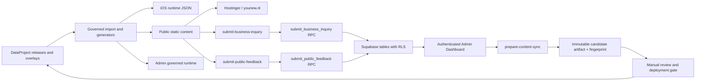

# YouNew system map

Status date: 2026-07-28 (Europe/Amsterdam)

This document separates verified repository or connected-environment facts from deployment assumptions.

## System boundaries

| Component | Purpose | Authoritative source | Runtime / deployment | Access and security | Verified state |
|---|---|---|---|---|---|
| DataProject | Governed content releases, overlays, evidence and acceptance locks | `DataProject/` | Build-time input only | Repository review and release rules | `amsterdam-v0.1.2` and `cities-v0.1.0` produce 186 public records |
| iOS app | Native YouNew product | `YouNew/` and `YouNew.xcodeproj` | Apple distribution | Apple signing and App Store controls | Public App Store listing exists; exact public binary version was not independently verified |
| Public and business website | Guides, search, journeys, map, support and commercial inquiry | `admin-dashboard/public-site/` plus generated DataProject projection | Static Hostinger package in `public-site/out`; public URL `https://younew.nl` | Static CSP/headers; public writes only through controlled Edge Functions | Local release candidate builds 230 static pages; production still serves an older artifact |
| Admin Dashboard | Protected content, feedback, business, sync and operational UI | `admin-dashboard/src/` | Next.js server application; deployment URL was not supplied | Supabase JWT plus approved `owner`/`admin` roles; service-role key remains server-side | Local build and role tests pass; authenticated production E2E is still required |
| Supabase | Authentication, database, RLS, RPCs and Edge Functions | Project `pgdzdxsiagfjioxwuqxf`, migrations under `admin-dashboard/supabase/` | Supabase `eu-west-1`, PostgreSQL 17.6 | RLS, least-privilege grants, service-role-only public-write RPCs, role checks | Connected project is healthy; release migration and three functions are not deployed |
| GitHub | Version control and CI | `https://github.com/zq87xf5jyp-arch/YouNew.git` | GitHub Actions | Repository permissions and protected-branch policy | Local branch `admin-dashboard-integration`; baseline SHA `66ecc29e`; working tree contains pre-existing changes |
| Apple App Store | iOS distribution entry | Apple listing ID `6782617312` | `https://apps.apple.com/app/id6782617312` | App Store Connect | Listing resolves; no new binary is part of this release candidate |

## Data and request flow

## Authority rules

- `DataProject` is the source of truth for released public and iOS content.
- Generated JSON is reproducible output, not an editorial source.
- Admin article publication can create a candidate artifact; it cannot silently overwrite DataProject, iOS data or the public artifact.
- Public forms do not write directly to tables. They call Edge Functions, which validate, rate-limit and invoke service-role-only RPCs.
- Production activation is a separate operation and requires the exact instruction `GO LIVE`.

## Known deployment gaps

- The new migration and Edge Functions are local only.
- The current production website and the two release-critical image URLs returned `200` on the final 28 July check. Production still lacks HSTS and the new Supabase-backed form contract.
- The Admin Dashboard production URL and hosting platform were not supplied.
- Supabase Auth leaked-password protection and managed backups are unavailable on the current Free plan; the owner accepted these limitations on 2026-07-28.
- A fresh database backup and authenticated owner/admin browser E2E have not yet been executed.
