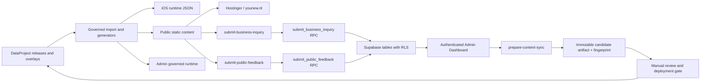

# YouNew system map

Status date: 2026-07-30 (Europe/Amsterdam)

This document separates verified repository or connected-environment facts from deployment assumptions.

## System boundaries

| Component | Purpose | Authoritative source | Runtime / deployment | Access and security | Verified state |
|---|---|---|---|---|---|
| DataProject | Governed content releases, overlays, evidence and acceptance locks | `DataProject/` | Build-time input only | Repository review and release rules | `amsterdam-v0.1.2` and `cities-v0.1.0` produce 186 public records |
| iOS app | Native YouNew product | `YouNew/` and `YouNew.xcodeproj` | Apple distribution | Apple signing and App Store controls | Public App Store listing exists; exact public binary version was not independently verified |
| Public and business website | Guides, search, journeys, map, support and reviewed commercial inquiry | `admin-dashboard/public-site/` plus generated DataProject projection | Static Hostinger package in `public-site/out`; public URL `https://younew.nl` | Static CSP/headers; public writes only through controlled Edge Functions | Local candidate builds 585 static routes with 575 indexable URLs; live browser QA passed for home, guides, business and one guide route |
| Admin Dashboard | Protected content, feedback, business, sync and operational UI | `admin-dashboard/src/` | Next.js server application at `https://admin.younew.nl` | Supabase JWT plus approved `owner`/`admin` roles; service-role key remains server-side | DNS/TLS, anonymous redirect to `/login`, local role tests and production build pass; authenticated production E2E is still required |
| Supabase | Authentication, database, RLS, RPCs and Edge Functions | Project `pgdzdxsiagfjioxwuqxf`, migrations under `admin-dashboard/supabase/` | Supabase `eu-west-1`, PostgreSQL 17.6 | RLS, least-privilege grants, service-role-only public-write RPCs, role checks | Connected project is healthy; 11 remote migrations and 4 active Edge Functions are present |
| GitHub | Version control and CI | `https://github.com/zq87xf5jyp-arch/YouNew.git` | GitHub Actions | Repository permissions and protected-branch policy | Local branch `admin-dashboard-integration`; baseline SHA `a3e59642`; working tree is dirty and branch differs from its remote |
| Apple App Store | iOS distribution entry | Apple listing ID `6782617312` | `https://apps.apple.com/app/id6782617312` | App Store Connect | Listing resolves; no new binary is part of this release candidate |

## Data and request flow

## Authority rules

- `DataProject` is the source of truth for released public and iOS content.
- Generated JSON is reproducible output, not an editorial source.
- Admin article publication can create a candidate artifact; it cannot silently overwrite DataProject, iOS data or the public artifact.
- Public forms do not write directly to tables. They call Edge Functions, which validate, rate-limit and invoke service-role-only RPCs.
- Production activation is a separate operation and requires the exact instruction `GO LIVE`.

## Known release and transaction gaps

- The local `analytics-ingest` correction is newer than the deployed function and is not deployed because the current working tree is not a reviewable release commit.
- `admin.younew.nl` is reachable and protects `/dashboard`, but authenticated owner/admin workflows and authorization denial have not been exercised in production.
- Supabase Auth leaked-password protection and managed backups are unavailable on the current Free plan; the owner accepted these limitations on 2026-07-28.
- A fresh off-site database dump with `pg_restore --list`, restore rehearsal, signed/tagged release identity and clean CI on that identity have not yet been produced.
- The iOS Debug app and exact unsigned device Release gate compile/link successfully. The current local CoreSimulator still could not install/launch the test runner reliably; this is recorded as an infrastructure-blocked runtime test, not a test pass.
- Commercial inquiries are review-only. Advertiser self-service, verified profiles, live campaigns, billing and accepted-lead reporting are not production capabilities.
