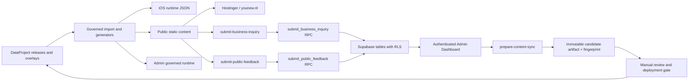

# YouNew system map

Status date: 2026-08-01 (Europe/Amsterdam)

This document separates verified repository or connected-environment facts from deployment assumptions.

## System boundaries

| Component | Purpose | Authoritative source | Runtime / deployment | Access and security | Verified state |
|---|---|---|---|---|---|
| DataProject | Governed content releases, overlays, evidence and acceptance locks | `DataProject/` | Build-time input only | Repository review and release rules | The accepted release set, including `amsterdam-v0.1.5`, produces 183 public records |
| iOS app | Native YouNew product | `YouNew/` and `YouNew.xcodeproj` | Apple distribution | Apple signing and App Store controls | Public App Store listing exists; exact public binary version was not independently verified |
| Public and business website | Guides, search, journeys, map, support and reviewed commercial inquiry | `admin-dashboard/public-site/` plus generated DataProject projection | Static package in `public-site/out`; public URL `https://younew.nl` | Static CSP/headers; public writes only through controlled Edge Functions | Candidate builds 582 static routes with 572 indexable URLs; 105 tests, link, smoke, security and predeploy gates pass |
| Admin Dashboard | Protected content, feedback, business, sync and operational UI | `admin-dashboard/src/` | Next.js server application at `https://admin.younew.nl` | Supabase JWT plus approved `owner`/`admin` roles; service-role key remains server-side | Anonymous routes redirect to `/login`; local lint/type/test/build pass and authenticated production E2E passed for all protected navigation routes |
| Supabase | Authentication, database, RLS, RPCs and Edge Functions | Project `pgdzdxsiagfjioxwuqxf`, migrations under `admin-dashboard/supabase/` | Supabase `eu-west-1`, PostgreSQL 17.6 | RLS, least-privilege grants, service-role-only public-write RPCs, role checks | Connected project is healthy; 13 remote migrations and 4 active Edge Functions are present; governance hardening is applied |
| GitHub | Version control and CI | `https://github.com/zq87xf5jyp-arch/YouNew.git` | GitHub Actions | Repository permissions and protected-branch policy | Release work is isolated on `codex/release-readiness-20260801`; its final SHA and CI status are release gates |
| Apple App Store | iOS distribution entry | Apple listing ID `6782617312` | `https://apps.apple.com/app/id6782617312` | App Store Connect | Listing resolves; no new binary is part of this release candidate |

## Data and request flow

## Authority rules

- `DataProject` is the source of truth for released public and iOS content.
- Generated JSON is reproducible output, not an editorial source.
- Admin article publication can create a candidate artifact; it cannot silently overwrite DataProject, iOS data or the public artifact.
- Public forms do not write directly to tables. They call Edge Functions, which validate, rate-limit and invoke service-role-only RPCs.
- Production activation is a separate operation and requires the exact instruction `GO LIVE`.

## Known release and transaction gaps

- The reviewed `analytics-ingest` source must be deployed from the final release identity and then smoke-tested; the currently deployed function is behaviorally equivalent but not byte-identical.
- Authenticated production navigation E2E passed. A destructive workflow exercise and an unapproved-user denial test were intentionally not performed against live data.
- Supabase Auth leaked-password protection and managed backups are unavailable on the current Free plan; the owner accepted these limitations on 2026-07-28.
- A fresh off-site database dump with `pg_restore --list` and an isolated restore rehearsal require temporary database credentials that are not stored in the repository. The release still requires a final Git identity and green CI on that identity.
- The iOS unit suite passed 469 tests and an unsigned Release simulator build completed. The local CoreSimulator became unresponsive while executing UI automation; interrupted UI cases remain an infrastructure gate, not a pass.
- Commercial inquiries are review-only. Advertiser self-service, verified profiles, live campaigns, billing and accepted-lead reporting are not production capabilities.
