# YouNew — Product Requirements, UX Strategy и Information Architecture

Дата: 6 августа 2026 года
Статус: **канонический продуктовый документ для Web, iOS, Admin, Supabase и Naruto; реализация требует отдельного утверждения**

Основа документа — подтверждённый UX/IA-аудит live-сайта. Стратегические разделы после аудита являются требованиями и гипотезами продукта, а не доказательством уже работающих функций.

## 1. Итог

Главная проблема YouNew — не отсутствие контента и не цветовая схема. Проблема в том, что четыре разные системы пытаются направлять пользователя одновременно:

1. карточки задач на главной;
2. профиль пользователя на главной и в Discover;
3. четырёхшаговый planner `/start/`;
4. длинные последовательности `/journeys/`.

При этом Search, Guides, Categories, Discover, Cities, Municipalities, Places и Organizations используют разные способы организации одного и того же контента. Пользователь видит много входов, но не всегда понимает, какой из них является правильным.

**Решение:** оставить одну общую модель намерений и последовательность `задача → уточнение → решение → официальный источник`. Главная должна показывать страну, один главный поиск и десять задач. Профиль и муниципалитет следует запрашивать только после выбора задачи.

### YouNew Golden Rule

> Пользователь приходит не за информацией. Пользователь приходит решить проблему. Каждый экран должен приближать человека к решению одной реальной жизненной задачи. Если экран не помогает сделать следующий полезный шаг — экран нужно переделать.

Английская продуктовая формулировка:

> The user never searches for information. The user searches for a solution. Every screen must move the user closer to solving one real-life problem. Information is only valuable if it leads to a useful next action.

Эта Golden Rule важнее количества страниц, карточек и организаций. Она применяется к Web, iOS, Admin, Search, Naruto и будущим Supabase-функциям.

### Почему пользователь останется именно в YouNew

Официальные сайты уже содержат правила. YouNew не должен конкурировать с ними объёмом текста. Его уникальная ценность — превратить разрозненные источники в безопасный и продолжающийся путь:

1. **Понять намерение:** что человек действительно пытается сделать.
2. **Сузить выбор:** показать один подходящий маршрут, а не двадцать карточек.
3. **Добавить контекст:** национальное правило плюс проверенная локальная информация.
4. **Довести до действия:** checklist, decision, booking handoff или официальный источник.
5. **Сохранить продолжение:** прогресс, следующий шаг и обновление источника.
6. **Вернуть уверенность:** пользователь понимает, что уже сделано и что делать дальше.

Основной retention loop:

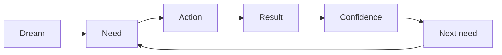

YouNew становится полезным не потому, что хранит больше информации, а потому, что помнит контекст задачи, показывает проверенный следующий шаг и помогает продолжить путь.

### Общая оценка

| Область | Состояние | Подтверждённое наблюдение |
|---|---|---|
| Техническая целостность URL | Хорошо | 623 HTML-маршрута; 616 URL в sitemap; orphan routes и повторяющиеся canonical не найдены |
| Фокус главной | Плохо | поиск, 10 задач, 6 профилей, муниципалитет, направления жизни, популярные задачи, города, сервисы, доверие, Business и Updates конкурируют на одной странице |
| Поиск | Требует P0 | запрос `I need a GP` даёт правильный первый результат, но третьим показывает несвязанный LGBTIQ+ материал |
| Guides | Требует P0 | live-каталог сообщает `0 step-by-step guides` и `15 verified summaries` |
| Product Value | Требует P0 | страницы маркируют источники, но не имеют общего обязательного результата `user leaves with` |
| Product Journey | Требует P1 | отдельные profiles и journeys существуют, но не образуют один путь `Dream → Need → Action → Result → Confidence` |
| Content Operations | Требует P0 | источники и review dates есть, но нет единого lifecycle, version gate и monitoring queue |
| Trust | Требует P1 | provenance существует, но evidence level, limitations и review history не собраны в единый видимый слой |
| Feedback | Требует P1 | нет замкнутого пути от пользовательского сигнала к review, новой версии и Coverage Dashboard |
| Географическое покрытие | Требует P1 | 177 из 181 локальных сущностей текущего dataset относятся к Amsterdam; ещё четыре города имеют по одной сущности |
| Категории | Требует P1 | 22 из 32 категорий имеют `entityCount = 0`; их нельзя показывать как обычные наполненные каталоги |
| Навигация | Требует P1 | desktop navigation скрывается при ширине `≤1280px`, поэтому на типичном ноутбуке остаётся hamburger |
| Доступность | Средне | landmarks, headings, skip-link, labels и theme toggle есть; длинная мобильная страница и маленький вторичный текст ухудшают сканирование |
| Безопасность информации | Хорошая база | official sources, verification dates, предупреждения и отдельный Emergency уже предусмотрены |

## 2. Подтверждённые факты и ограничения аудита

### Проверено

- live-сайт `https://younew.nl/` в desktop- и mobile-состояниях;
- поиск по пользовательскому намерению;
- каталоги Guides и Discover;
- planner `/start/` и Journeys;
- муниципальная страница Groningen;
- дерево маршрутов, sitemap, header/footer и текущий dataset в репозитории;
- автоматический IA-аудит статической сборки.

### Не проверено

- авторизованные сценарии Supabase и Business workspace;
- синхронизация с iOS-приложением;
- реальные analytics funnels и пользовательские интервью;
- полный screen-reader и keyboard-only аудит;
- юридическая или медицинская корректность каждой отдельной инструкции.

Поэтому выводы о навигации, поиске и структуре подтверждены. Выводы о конверсии и реальном поведении пользователей требуют аналитики после внедрения.

## 3. Аудит пользовательских сценариев

### Шаг 1 — вход на главную

Состояние: **визуально сильная, продуктово перегруженная**.

Брендовый фон запоминается, но продаёт YouNew и Naruto сильнее, чем жизнь в Нидерландах. В первом экране одновременно конкурируют поиск, `Find my next step`, `Ask Naruto` и `Explore the Netherlands`.

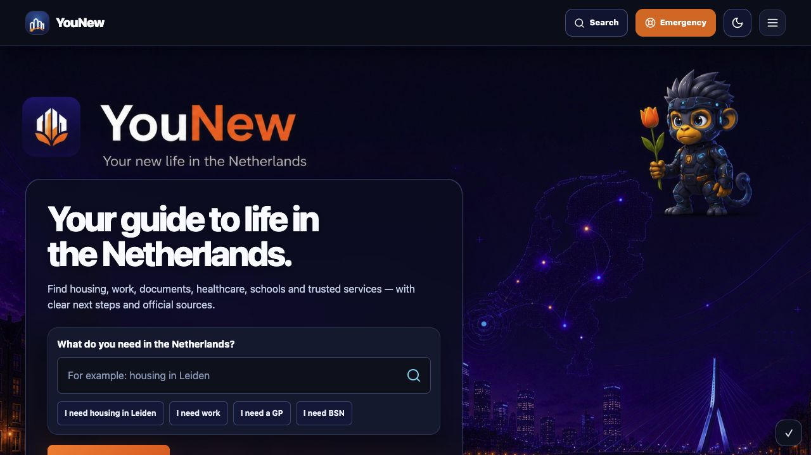

### Шаг 2 — выбор задачи

Состояние: **понятные десять направлений, но карточка ведёт в выдачу, а не в последовательный task flow**.

Сами десять задач соответствуют новой философии. Проблема появляется после клика: Housing, Work, Healthcare и другие открывают поисковую выдачу с результатами разных типов вместо одного следующего вопроса.

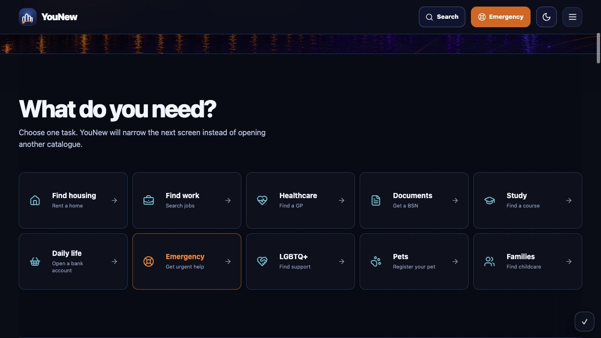

### Шаг 3 — поиск врача

Состояние: **результат существует, ранжирование смешивает намерения**.

`I need a GP` возвращает 15 результатов. Первым показан национальный healthcare guide, вторым — category, третьим — LGBTIQ+ support. Для пользователя с конкретной задачей третий результат нерелевантен. Поиск должен сначала показать один answer card и только затем дополнительные материалы.

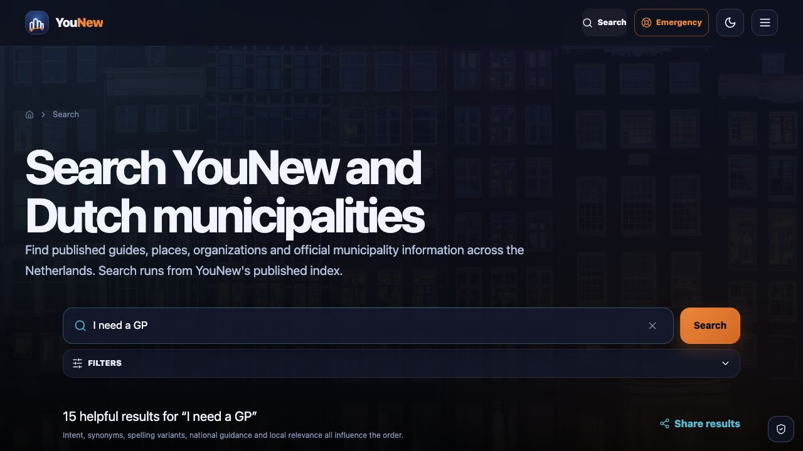

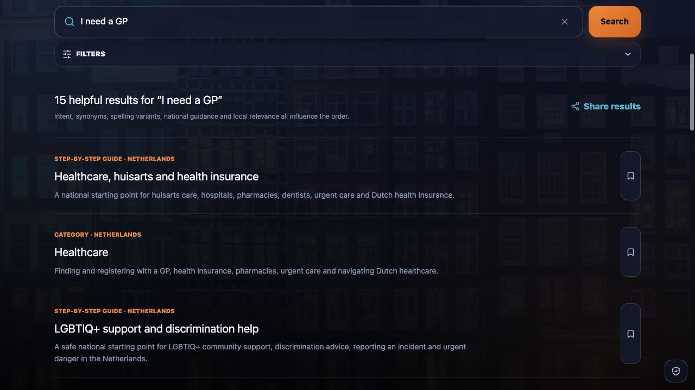

### Шаг 4 — каталог Guides

Состояние: **честная маркировка, но неверное продуктовое обещание**.

Каталог прямо показывает `0 step-by-step guides · 15 verified summaries`. Все 15 локальных summary guides относятся к Amsterdam. В репозитории отдельно есть 23 national guides, но пользовательская классификация между `Guides` и `Essentials` неочевидна.

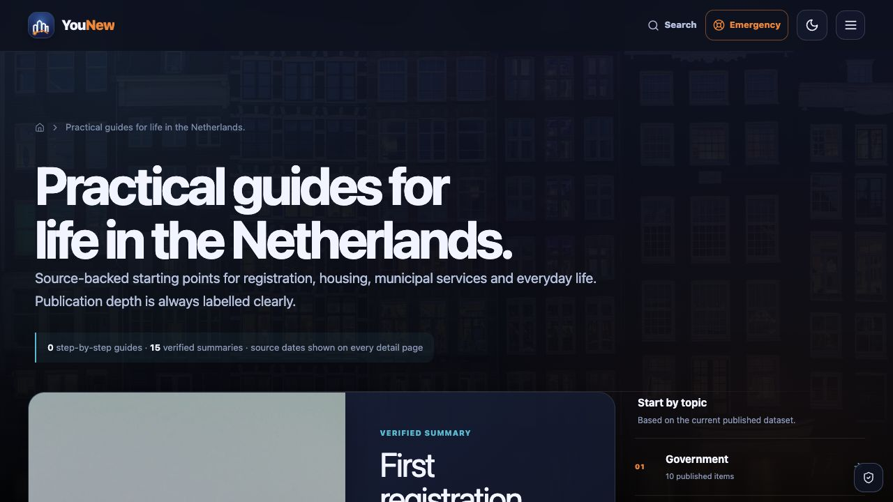

### Шаг 5 — Journeys

Состояние: **полезная функция, но слишком длинная и дублирует planner**.

Journeys содержит 8 сценариев с последовательностями по 6–7 материалов и локальным статусом прочтения. Это пригодно как долгосрочный план, но не как ответ на срочную задачу. Journeys должен использовать ту же taxonomy, что Search и Start, и появляться после выдачи решения как опция `Build a longer plan`.

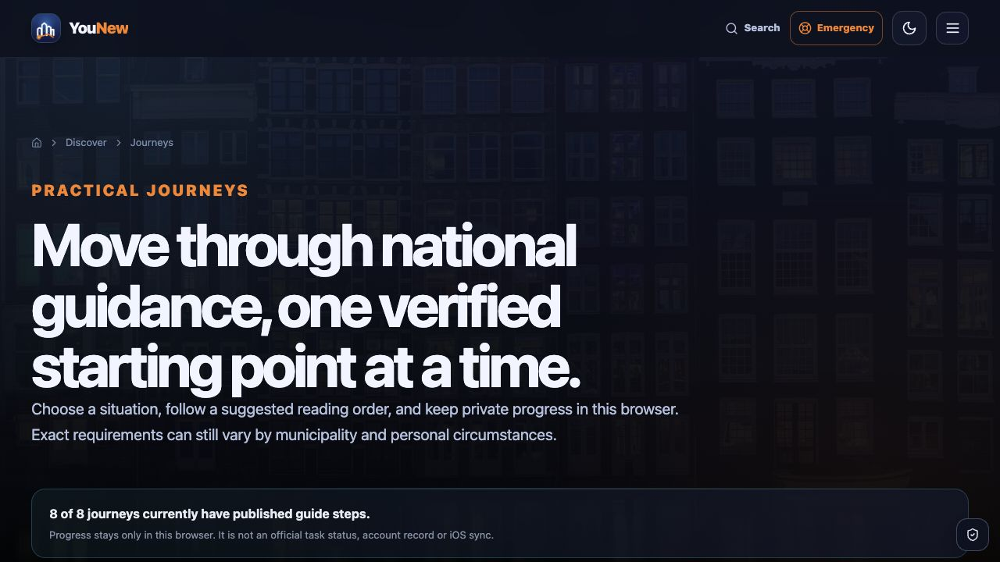

### Шаг 6 — муниципалитет Groningen

Состояние: **точно и безопасно, но это directory entry, а не практический local guide**.

Страница ясно отделяет административные факты от редакционного покрытия и даёт официальный сайт. Однако пользователь, пришедший за BSN, GP или waste collection, должен попадать не в список муниципальных фактов, а в соответствующую задачу с Groningen context.

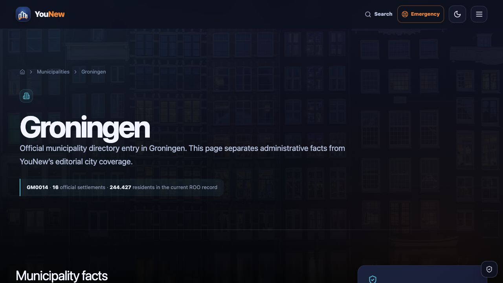

### Шаг 7 — мобильная главная

Состояние: **корректная адаптация, чрезмерная длина**.

Первый экран читается, но hero занимает почти весь viewport. Десять task cards становятся длинной вертикальной колонкой. Затем идут шесть крупных profile cards и select с 342 муниципалитетами. Пользователь должен долго прокручивать до эмоциональных и городских разделов.

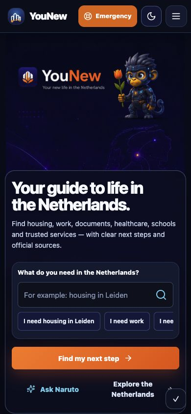

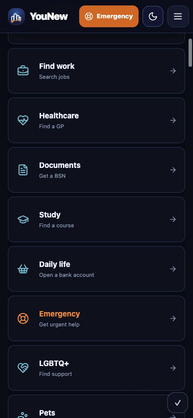

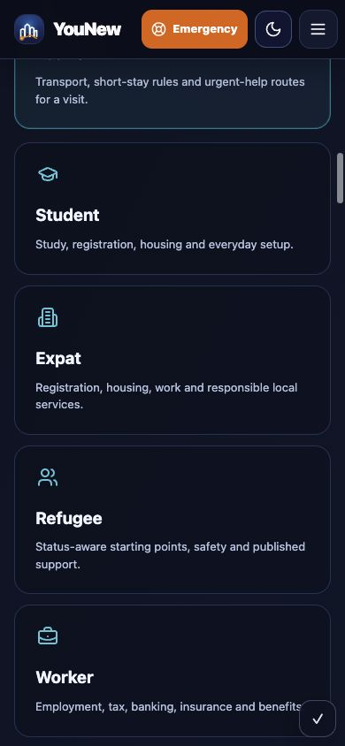

### Шаг 8 — Discover и Start

Состояние: **функционально, но пользователь повторно выбирает одни и те же параметры**.

Discover начинает с шести профилей. Start снова спрашивает задачу, ситуацию и area в четырёх шагах. На главной уже существует ещё один profile selector. Эти элементы должны использовать один общий state и одну общую decision engine.

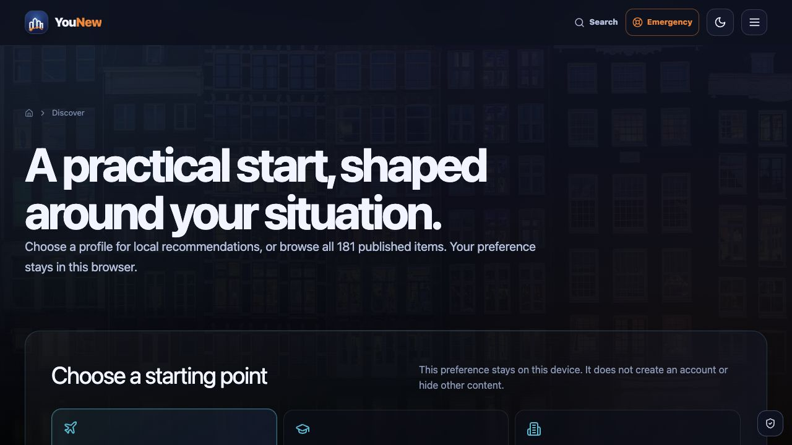

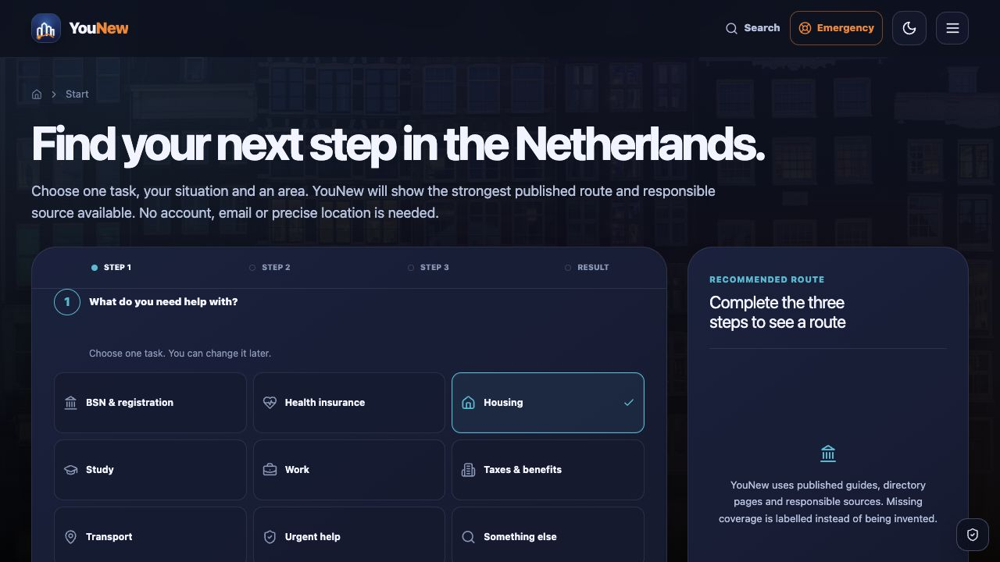

## 4. Что работает и должно быть сохранено

- единый темный visual language, orange emergency акцент и theme toggle;
- задача и поиск как основные входы;
- официальные источники, даты проверки и предупреждения;
- разделение organic guidance и рекламы;
- отсутствие выдуманных результатов при нулевой выдаче;
- статическая генерация, canonical URLs и sitemap;
- отдельные administrative municipality entries;
- local-only progress без обязательного аккаунта;
- saved items и recently viewed как вторичные возможности.

## 5. Основные дефекты и приоритеты

| Приоритет | Дефект | Влияние | Исправление |
|---|---|---|---|
| P0 | Четыре конкурирующих choice systems | Пользователь повторяет выбор и не понимает правильный путь | одна taxonomy и decision engine для Home, Search, Start, Journeys, Naruto и iOS |
| P0 | Search выдаёт список типов вместо ответа | конкретная задача превращается в каталог | answer card первым; related content вторым; строгий intent match |
| P0 | Нет единого шаблона решения | на страницах не всегда одновременно есть fit, location, requirements и next step | обязательная структура каждой task page |
| P0 | Нет Product Value publication gate | страница может быть опубликована без полезного результата | обязательные `user_leaves_with`, `next_action` и official source |
| P0 | Нет измерения Time to Useful Action | количество кликов не показывает реальную скорость решения | baseline и proposed target median ≤60 секунд |
| P0 | Нет общего Content Lifecycle | контент может устаревать неуправляемо в разных клиентах | lifecycle states, publication gates, monitoring и versioned release |
| P0 | Draft homepage уже расширен до 18 task cards | риск снова увеличить информационный шум | не публиковать это расширение; оставить 10 задач, остальные вложить в task hubs |
| P1 | 22 пустые категории | создают ложное ощущение покрытия | скрыть из каталога или превратить в честные task hubs с national guide |
| P1 | 97,8% локальных сущностей относятся к Amsterdam | национальный интерфейс обещает больше, чем редакционное покрытие | маркировать directory vs editorial; наращивать города по приоритету |
| P1 | `/categories`, `/discover`, `/guides` и Search пересекаются | неясно, где начинать | определить одну роль для каждого уровня |
| P1 | `Cities` и `Municipalities` воспринимаются как дубли | смешиваются страна, город и орган власти | Cities = жизнь и local guides; Municipalities = official local authority directory |
| P1 | Главная запрашивает профиль и 342 муниципалитета до намерения | высокий cognitive load | спрашивать location только после задачи и только когда она влияет на ответ |
| P1 | Нет системного Local Intelligence | city и municipality pages не превращают национальный ответ в local action | task-first city layer с freshness и явными coverage gaps |
| P1 | Naruto пока отдельная точка входа | AI конкурирует с Search вместо уточнения | встроенный clarification layer с safety triage и citations |
| P1 | Trust evidence раздроблен | пользователь видит `verified`, но не всегда видит scope и ограничения | единый trust card и categorical evidence level |
| P1 | Нет User Feedback Loop | ошибки и gaps не превращаются в управляемую работу | structured feedback → triage → review → approved version → dashboard |
| P1 | Desktop nav скрыта при `≤1280px` | важные разделы недоступны одним кликом на ноутбуке | укоротить labels и сохранить primary nav до 1024–1100px |
| P2 | Footer содержит 22 ссылки | повторяет карту сайта | оставить 8–12 ключевых ссылок и legal |
| P2 | Saved и My YouNew разделены | две точки для личного состояния | объединить в My YouNew, сохранить старый URL redirect/alias |

### Категории без локальных сущностей

В текущем generated dataset `entityCount = 0` у 22 категорий:

`Banking`, `Benefits`, `Business`, `Children`, `Daily life`, `Documents`, `Emergency`, `Family`, `Fines`, `Integration`, `Internet`, `Language learning`, `Legal help`, `Municipal services`, `Pets`, `Rules`, `Safety`, `Shopping`, `SIM & telecom`, `Taxes`, `Utilities`, `Work`.

Это не всегда означает полное отсутствие информации: для части тем уже есть national guide. Но такая страница не должна выглядеть как наполненный local catalogue. Она должна либо стать честным task hub, либо быть скрыта из каталога до появления проверенного ответа.

### Страницы с одной или без внутренних ссылок в main content

Статический аудит выявил 10 страниц с не более чем одной внутренней ссылкой в `<main>`:

| Routes | Интерпретация | Решение |
|---|---|---|
| `/emergency/` | допустимое исключение: главная задача — внешние экстренные действия | сохранить предельно сфокусированной |
| `/privacy/`, `/terms/`, `/offline/` | legal/technical pages не обязаны вести в продуктовый flow | оставить Home/Support utility links, не добавлять искусственные CTA |
| `/search/`, `/start/`, `/naruto/` | основные действия выполняются client controls, поэтому статический счётчик неполон | проверить zero, error и completed states; в каждом должен быть один явный next action |
| `/saved/`, `/my-younew/` | empty state рискует стать тупиком | добавить `Find a task` и `Continue journey`, затем объединить UI |
| `/support/` | поддержка должна направлять к контакту, status, privacy и emergency | добавить контекстные безопасные маршруты |

Автоматический результат `0 orphan routes` не доказывает хорошую находчивость: глобальные header/footer ссылки могут технически связать страницу, но не создать понятный пользовательский путь.

### Страницы без полного ответа или следующего шага

- summary guides подтверждают источник, но не являются пошаговым решением;
- broad national guides объединяют несколько вопросов и требуют split pages;
- municipality entries дают официальный контакт, но не отвечают на конкретную задачу пользователя;
- category pages часто смешивают national orientation и Amsterdam entities;
- city pages без редакционного покрытия заканчиваются предложением источника, а не полезным local task route;
- Search показывает несколько типов сущностей, но не объясняет, какой результат выбрать первым.

## 6. Новая navigation tree

Primary navigation — максимум 10 элементов:

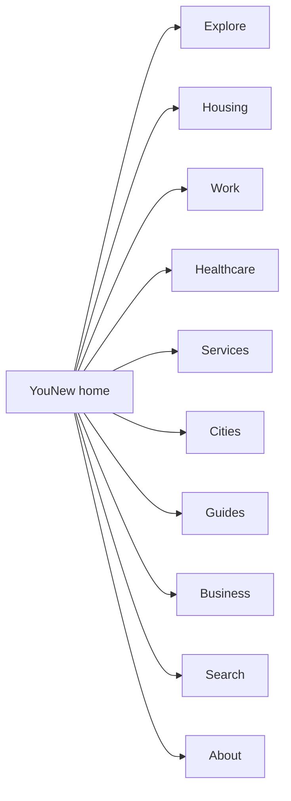

Utility navigation, не входящая в десять пунктов:

- Emergency — постоянная заметная кнопка;
- Theme — icon button;
- My YouNew — icon/account utility;
- Naruto — контекстная помощь внутри Search и task pages, а не ещё один верхнеуровневый каталог.

## 7. Полная новая sitemap

Ниже — продуктовая sitemap. Текущие entity URLs сохраняются как canonical или legacy aliases.

```text
/
├── search/                         # один помощник для всех intents
├── start/                          # один быстрый route planner
├── discover/                       # Explore the Netherlands
│   ├── living/
│   ├── working/                    # использует тот же контент, что /work/
│   ├── studying/                   # использует тот же контент, что /study/
│   ├── business/                   # ведёт в newcomer business route
│   ├── travel/
│   ├── nature/
│   ├── culture/
│   ├── transport/
│   ├── history/
│   └── food/
├── housing/
│   ├── find-a-room/
│   ├── temporary-housing/
│   ├── rental-contract/
│   ├── deposit-and-fees/
│   ├── registration-address/
│   ├── housing-permit/
│   ├── housing-benefit/
│   ├── landlord-or-repairs/
│   ├── buy-a-home/
│   └── homelessness-and-urgent-help/
├── work/
│   ├── find-a-job/
│   ├── right-to-work/
│   ├── employment-contract/
│   ├── salary-and-holiday-pay/
│   ├── taxes-from-work/
│   ├── sick-leave/
│   ├── dismissal/
│   ├── unemployment/
│   ├── diploma-recognition/
│   └── discrimination-at-work/
├── healthcare/
│   ├── health-insurance/
│   ├── find-a-gp/
│   ├── urgent-medical-help/
│   ├── specialist-or-hospital/
│   ├── dentist/
│   ├── medicines-and-pharmacy/
│   ├── mental-health/
│   ├── pregnancy-and-midwife/
│   ├── child-health/
│   └── complaint-about-care/
├── documents/
│   ├── register-with-municipality/
│   ├── get-bsn/
│   ├── get-digid/
│   ├── residence-permit/
│   ├── passport-or-id/
│   ├── driving-licence/
│   ├── address-change/
│   ├── birth-registration/
│   ├── marriage-or-partnership/
│   └── official-extract/
├── study/
│   ├── school-for-a-child/
│   ├── newcomer-class/
│   ├── mbo/
│   ├── hbo/
│   ├── university/
│   ├── student-finance/
│   ├── diploma-recognition/
│   ├── learn-dutch/
│   ├── civic-integration/
│   └── student-support/
├── daily-life/
│   ├── bank-account/
│   ├── phone-and-internet/
│   ├── energy-gas-water/
│   ├── waste-and-recycling/
│   ├── public-transport/
│   ├── bicycle/
│   ├── taxes/
│   ├── benefits/
│   ├── consumer-rights/
│   └── debt-and-legal-help/
├── lgbtiq/
│   ├── community-support/
│   ├── discrimination/
│   ├── report-an-incident/
│   └── urgent-danger/
├── pets/
│   ├── bring-a-pet/
│   ├── register-a-dog/
│   ├── veterinarian/
│   └── lost-or-found-pet/
├── family/
│   ├── childcare/
│   ├── school/
│   ├── child-benefit/
│   ├── pregnancy/
│   ├── birth-registration/
│   └── family-reunification/
├── emergency/                      # один клик с любого экрана
├── services/
│   ├── government/
│   ├── municipalities/
│   ├── immigration/
│   ├── tax/
│   ├── benefits/
│   ├── healthcare/
│   ├── education/
│   ├── transport/
│   ├── utilities/
│   └── legal-help/
├── cities/
│   ├── [city]/                     # редакционные city guides
│   ├── municipalities/             # UI alias к существующему directory
│   ├── provinces/
│   ├── places/
│   └── map/
├── guides/
│   ├── [task-guide]/               # step-by-step solution
│   ├── local/[local-summary]/      # проверенная local summary
│   └── journeys/                   # длинные планы после task result
├── business/
│   ├── start-a-business/           # пользовательская задача
│   ├── advertise/
│   ├── partners/
│   ├── pricing/
│   ├── apply/
│   └── media-kit/
├── my-younew/
│   ├── saved/
│   ├── progress/
│   └── preferences/
├── about/
│   ├── how-younew-works/
│   ├── sources-and-review/
│   ├── updates/
│   ├── app/
│   ├── status/
│   └── support/
├── privacy/
└── terms/
```

### Важный принцип sitemap

Это не означает, что все новые красивые URL нужно создать одновременно. Сначала вводится единая taxonomy и route resolver. Существующие `/essentials/[slug]/`, `/guides/[slug]/`, `/categories/[slug]/` и entity routes продолжают работать, пока новый слой постепенно становится canonical.

## 8. Что объединить

| Текущие элементы | Новая роль | Решение |
|---|---|---|
| Homepage profile selector + Discover profile selector + Start profile step | единый optional context | оставить выбор только внутри `/start/` или после search intent |
| Search synonyms + planner goals + journey definitions + homepage arrays | единая intent taxonomy | один registry для web, iOS, admin, Supabase и Naruto |
| `/categories/` + broad catalog в Discover | Explore/task hubs | `/categories/` больше не отдельная пользовательская модель |
| `/organizations/` + Services | Trusted services directory | новый label и canonical `/services/`; legacy URL сохраняется |
| `/saved/` + `/my-younew/` | личное пространство | Saved становится вкладкой My YouNew |
| Updates + Status + Support + App | About | URLs сохраняются, меняется иерархия и ссылки |
| Business overview + advertise + partners + pricing + apply + media kit | Business hub | одна business navigation внутри раздела |
| Cities + Municipalities entry points | Cities hub с двумя понятными типами | данные не смешивать: editorial city и official municipality остаются разными |

## 9. Что удалить или убрать из пользовательской IA

Hard delete не рекомендуется: он противоречит требованию сохранить URL.

| Элемент | Действие |
|---|---|
| `/categories/` directory | после запуска task hubs — `301` на `/discover/` или новый task index |
| category pages с нулём сущностей | убрать из каталогов; оставить как task hub только при наличии полноценного national guide |
| отдельный `/saved/` UI | после миграции local storage — `301` на `/my-younew/?tab=saved` |
| `/offline/` | оставить технически, исключить из navigation и sitemap |
| Business workspace без активного аккаунта | не публиковать как обычную public page; оставить auth-gated/noindex |
| дублирующиеся profile selectors | убрать с Home и Discover |
| длинные catalog lists на Home | убрать; доступ через Search, Explore и hubs |

## 10. Что разделить

Текущие national guides полезны как orientation, но некоторые отвечают сразу на несколько вопросов.

| Текущая страница | Разделить на |
|---|---|
| Housing and renting | room search, temporary housing, contract, deposit, address registration, benefit, dispute |
| Healthcare, huisarts and insurance | insurance, GP, urgent care, specialist, dentist, pharmacy |
| Documents, registration and DigiD | municipality registration, BSN, DigiD, address, residence document |
| Work and employment | job search, work rights, contract, salary, sick leave, dismissal, unemployment |
| Education and learning Dutch | child school, newcomer class, MBO/HBO/university, Dutch, diploma recognition |
| Rules, traffic and fines | traffic fine, parking fine, objection, local rules, police/reporting |
| Family, childcare and school | childcare, school, child benefits, birth, family reunification |
| Utilities and moving | electricity/gas, water, internet, waste, address change, move checklist |
| Consumer rights, scams and complaints | purchase complaint, subscription, scam, chargeback, regulator |
| Debt and legal help | urgent debt, payment plan, municipal debt help, legal aid, court route |
| Immigration, visas and residence | short stay, MVV, work, study, family, extension, permanent residence |

Summary page можно сохранить как hub, но каждый child должен отвечать на один вопрос.

## 11. Что переименовать

| Сейчас | Новый пользовательский label |
|---|---|
| Housing | Find a room or home |
| Work | Find work / Understand my contract |
| Healthcare | I need a doctor / Arrange healthcare |
| Documents | BSN, DigiD and registration |
| Education | School, study and Dutch |
| Benefits | I need income support |
| Banking | Open a bank account |
| Rules & Fines | I received a fine / Which rule applies? |
| Municipal services | Register and arrange local services |
| Local services | Services near me |
| Language learning | Learn Dutch |
| SIM & telecom | Phone and internet |
| Legal help | Rights, disputes and legal aid |
| Emergency | Urgent help now |
| Business category | Start a business / Become ZZP |

Commercial `Business` в primary navigation остаётся отдельным от пользовательской задачи `Start a business`.

## 12. Что убрать с homepage

1. Шесть profile cards.
2. Select с 342 муниципалитетами.
3. Три конкурирующих CTA в hero; оставить один assistant search и один secondary Explore link.
4. Расширение task grid до 18 карточек из текущего draft; сохранить только 10 верхнеуровневых задач.
5. Отдельные большие блоки `Useful services` и `Trusted resources`; объединить в один `Trusted services` максимум из 9 элементов.
6. Отдельный рекламный Business block; оставить Business как один элемент Trusted services. Реальные объявления показывать только контекстно и после проверки кампании.
7. Длинный `Why YouNew`; оставить 6 коротких доказательств.
8. Более трёх Latest updates.
9. Footer из 22 ссылок; оставить 8–12 ключевых ссылок плюс legal.

## 13. Wireframe новой главной

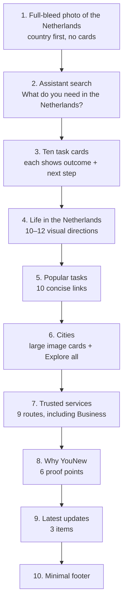

### Поведение первого экрана

- desktop: страна занимает 60–70% viewport height; assistant search находится сразу под hero или слегка перекрывает его нижнюю границу;
- mobile: изображение 38–45% viewport; search и первая task row видны без длинной прокрутки;
- Naruto вызывается внутри Search как `Ask a follow-up`, а не конкурирует с поиском;
- theme toggle и Emergency остаются в header.

## 14. Новый пользовательский путь

### Пример: `I need a GP in Groningen`

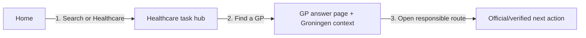

GP answer page обязан показывать:

1. **Что мне подходит?** Regular GP, out-of-hours GP или emergency.
2. **Где это найти?** National explanation плюс Groningen/local source, если проверен.
3. **Что потребуется?** Insurance details, ID/BSN only where actually required, registration conditions.
4. **Что делать дальше?** Один primary CTA и официальный источник.

### 3-click acceptance rules

| Сценарий | Максимальный путь |
|---|---|
| BSN | Home → Documents → Get BSN → official municipality action |
| GP | Home → Healthcare → Find a GP → responsible route |
| Housing | Home → Find housing → exact need → verified next action |
| City exploration | Home → Cities → city → local guide/service |
| Emergency | любая страница → Emergency |

Если путь превышает три клика, это regression defect.

## 15. Product Journey — от мечты к уверенности

Information Architecture отвечает, где находится решение. Product Journey отвечает, как человек движется через жизненную ситуацию и почему возвращается в YouNew.

### Эмоциональная модель

| Стадия | Что чувствует человек | Что должен сделать YouNew | Ценность на выходе |
|---|---|---|---|
| Dream | интерес, надежда, неопределённость | показать жизнь в Нидерландах и понятные возможности | желание исследовать |
| Need | тревога и конкретная проблема | распознать intent и убрать лишние варианты | понятная задача |
| Action | страх ошибки | показать требования, ограничения и один следующий шаг | безопасное действие |
| Result | ожидание подтверждения | сохранить checklist, handoff или завершённый шаг | видимый результат |
| Confidence | вопрос «что дальше?» | предложить следующий релевантный шаг и изменения источника | контроль над ситуацией |

### Tourist journey

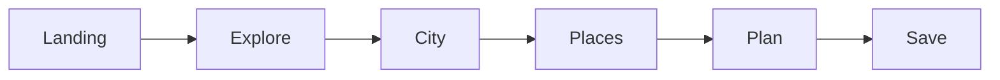

Ценность: вдохновение превращается в сохранённый план города, транспорта и экстренных контактов.

### Student journey

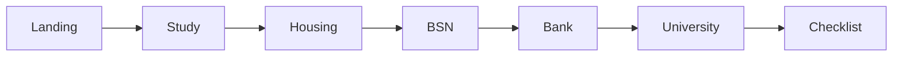

Ценность: не каталог студенческих статей, а последовательность до готовности начать учёбу.

### Worker journey

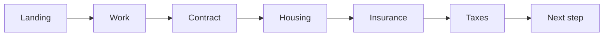

Ценность: пользователь понимает не только как найти работу, но и что меняется после подписания контракта.

### Refugee journey

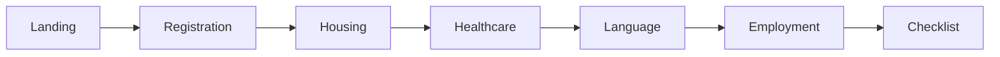

Ценность: статус-aware route без смешивания официальных решений, общих советов и неподтверждённой локальной помощи.

### Правило применения journeys

Macro journey может длиться недели или месяцы. Правило трёх кликов относится к каждой отдельной задаче внутри journey. Например, `Student → BSN` должен открыть полезное действие максимум за три клика, даже если весь student journey содержит семь этапов.

Journey не должен заставлять проходить предыдущие этапы, если пользователь пришёл сразу за конкретным решением. Progress — рекомендательный, не официальный статус и не блокировка доступа.

### Journey roadmap после V1

После проверки четырёх базовых сценариев taxonomy можно расширить: `EU citizen`, `Non-EU resident`, `Highly skilled migrant`, `Family with children`, `Entrepreneur/ZZP`, `International student`, `Elderly user`, `Person with disability`.

Новый journey создаётся только если меняется последовательность задач, требования или ответственные источники. Persona label не должен дублировать существующий journey и не должен интерпретироваться как юридическая классификация или решение о праве пользователя на услугу.

## 16. Product Value Layer

Каждая публикуемая страница должна иметь явный `value contract`: что пользователь унесёт с неё кроме текста.

### Возможные результаты страницы

- **Answer** — понятный ответ на один вопрос;
- **Checklist** — конкретные действия или документы;
- **Decision** — помощь выбрать подходящий маршрут;
- **Booking handoff** — переход к проверенной записи или заявке;
- **Official source** — ответственный источник, открытый в нужном контексте;
- **Saved item** — сохранённая задача, место или инструкция;
- **Progress** — следующий этап долгого journey.

### Publication gate

Обычная task page не должна публиковаться, если отсутствует хотя бы один primary outcome и обязательные поля:

```text
question
fit_or_scope
requirements
next_action
official_source
verified_at
user_leaves_with
```

Legal, About и editorial inspiration pages могут быть информационными, но должны честно маркироваться и не маскироваться под решение задачи.

### Value matrix по типам страниц

| Тип страницы | Обязательная ценность |
|---|---|
| Homepage | Decision: выбрать задачу или направление |
| Search result | Answer + один best next action |
| Task hub | Decision + переход к точному вопросу |
| Solution page | Answer + Requirements + Official source/Booking handoff |
| City page | Local decision + Save/Plan |
| Municipality page | Official local source + task shortcuts |
| Organization page | Fit + responsible contact/booking handoff |
| Journey | Checklist + Progress + next recommended step |
| Naruto answer | Clarified answer + citations + action |

### Product outcome rule

Если пользователь выходит только с новой информацией, страница слабая. Если он выходит с ответом, решением, checklist, сохранённым планом или начатым официальным действием — страница создаёт продуктовую ценность.

## 17. Local Intelligence

Local Intelligence — это не ещё один городской каталог. Это слой, который отвечает: **что именно меняется для этой задачи в конкретном месте?**

Формула local answer:

```text
National rule
+ responsible local authority
+ verified local providers
+ city-specific requirements
+ freshness date
+ explicit coverage gaps
= Local Intelligence answer
```

### Пример Leiden

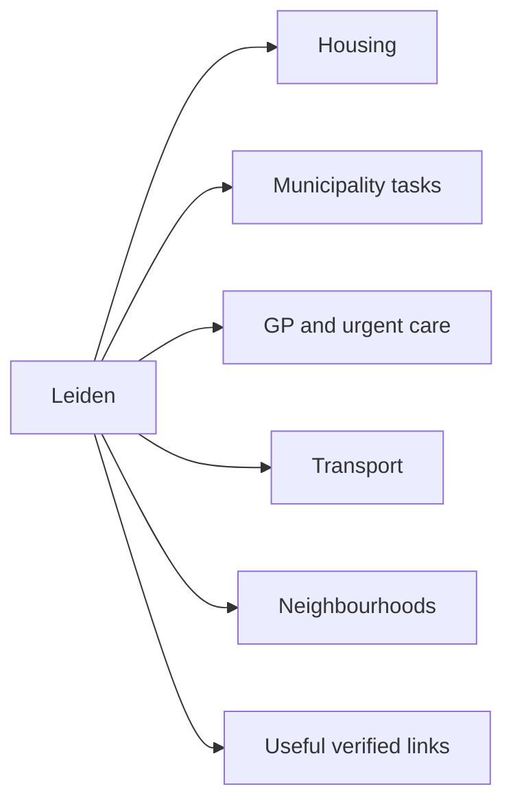

City page должна начинаться с наиболее полезных задач, а не с административного описания. Для каждого local block показываются источник, дата проверки и статус покрытия.

### Ограничение для volatile data

Current waiting time, цены, доступность жилья, расписания и opening hours быстро меняются. Их можно показывать только при наличии структурированного источника, timestamp и автоматического обновления. В остальных случаях YouNew должен показывать `Check current waiting time` и вести на ответственный источник, а не сохранять устаревающее число.

### Location rule

Город запрашивается только тогда, когда он меняет решение. Если ответ национальный, пользователь сразу получает национальную инструкцию. Если нужен муниципалитет, location clarification появляется после intent, а не на главной.

## 18. AI Layer — Search и Naruto

Naruto не должен быть отдельным источником знаний или ещё одним каталогом. Он является безопасным clarification layer над опубликованным index.

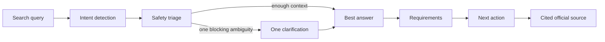

### Пример `I need a GP`

1. Сначала проверить urgency: обычный GP, huisartsenpost или immediate danger.
2. Если срочности нет и local route важен — спросить municipality или postcode area без точного адреса.
3. Показать один лучший answer card.
4. Ниже — требования, один primary action и cited official source.
5. Дополнительные материалы показывать после решения, а не вместо него.

### AI guardrails

- Emergency guidance показывается до уточняющих вопросов, если есть признаки угрозы жизни;
- ответы строятся только из published index и cited sources;
- Naruto не принимает юридические, медицинские или immigration решения за пользователя;
- неопределённость и отсутствие покрытия маркируются явно;
- чувствительные данные не требуются для общей ориентации и не сохраняются без явного согласия;
- sponsored content не влияет на ответ и organic ranking;
- clarification задаётся только тогда, когда реально меняет маршрут;
- пользователь всегда может открыть исходный официальный источник.

## 19. Coverage Dashboard для Admin

Admin нужен не список Categories, а dashboard, который показывает, какие реальные задачи уже покрыты и где пользователь попадёт в тупик.

### Главный экран

| Task domain | Coverage | Freshness | Local depth | Search gaps | P0 blocker |
|---|---:|---:|---:|---:|---|
| Housing | calculated | calculated | by city | from zero-results | yes/no |
| Work | calculated | calculated | by city | from zero-results | yes/no |
| Healthcare | calculated | calculated | by city | from zero-results | yes/no |
| Pets | calculated | calculated | by city | from zero-results | yes/no |
| Business | calculated | calculated | by city | from zero-results | yes/no |

Значения нельзя заполнять вручную или считать по количеству страниц.

### Предлагаемая формула Coverage Score

| Компонент | Вес |
|---|---:|
| Verified answer существует | 25% |
| Responsible official source указан | 20% |
| Полезный next action существует | 20% |
| Requirements/checklist заполнены | 10% |
| Источник не просрочен | 10% |
| Нужный local context покрыт | 10% |
| Search/route QA пройден | 5% |

Итоговый процент должен раскрываться по компонентам. Один высокий composite score не должен скрывать отсутствие local coverage или просроченный источник.

### Dashboard views

- task × city coverage matrix;
- national vs local coverage;
- Content Lifecycle funnel: Idea → Research → Review → Published → Needs update;
- Trust completeness: evidence level, missing limitations, overdue review, translation status;
- content freshness и upcoming review dates;
- zero-result и reformulated queries;
- feedback backlog, outdated reports и feedback-to-fix time;
- pages without `next_action`;
- pages without official source;
- journeys с отсутствующими steps;
- EN/NL/RU coverage parity;
- sensitive P0 tasks с failed QA;
- source changes и broken outbound links.

### Автоматизация

Coverage Dashboard должен строиться из Supabase/content registry и QA events. Admin не должен вручную поддерживать проценты. При публикации CI проверяет publication gate, route integrity и наличие value contract.

## 20. KPI — Time to Useful Action

Правило трёх кликов измеряет глубину архитектуры. `Time to Useful Action` измеряет реальную скорость получения ценности.

### Определение

Timer starts:

- пользователь отправил assistant search;
- или выбрал task card;
- или открыл deep link на task page.

Timer stops при первом подтверждённом полезном действии:

- `official_source_opened`;
- `next_action_clicked`;
- `checklist_saved`;
- `booking_started`;
- `decision_route_selected`;
- `journey_step_saved`.

Page view, scroll и открытие нерелевантной карточки не считаются полезным действием.

### Предлагаемые цели

| KPI | Target после baseline |
|---|---:|
| Median Time to Useful Action | ≤ 60 секунд |
| P75 Time to Useful Action | ≤ 120 секунд |
| P0 tasks within 3 clicks | 100% |
| Search sessions with useful action | расти относительно baseline |
| Zero-result rate | снижаться без выдуманных ответов |
| Official-source handoff success | измерять по task и city |

Цели `60/120 секунд` являются продуктовой гипотезой. Перед фиксацией OKR нужно измерить baseline.

### Safety guardrail

TTUA нельзя улучшать за счёт удаления необходимых предупреждений, ложной персонализации или преждевременного booking handoff. Для Emergency, medical, legal и immigration routes измеряются отдельные safety metrics: correct triage, citation coverage, stale-source rate и unsafe-answer rate.

## 21. Content Lifecycle

Контент YouNew должен управляться как versioned product data, а не как набор страниц. Один и тот же approved content snapshot используется Web, iOS, Search и Naruto.

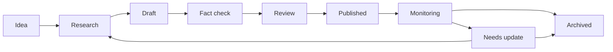

### Состояния и обязательные результаты

| State | Цель | Обязательный результат | Кто/что переводит дальше |
|---|---|---|---|
| Idea | зафиксировать пользовательский gap | task, audience, demand signal, risk level | product/content owner |
| Research | найти ответственные источники | source set, scope, known limitations | researcher/editor |
| Draft | создать один task answer | value contract, requirements, next action | author |
| Fact check | проверить утверждения | claim-to-source mapping, dates, contradictions | independent reviewer |
| Review | проверить UX, safety и язык | approval или список blocking issues | editor/safety reviewer |
| Published | выпустить immutable version | version ID, canonical route, approved snapshot | release pipeline |
| Monitoring | отслеживать изменения | source health, feedback, next review date | automation + owner |
| Needs update | остановить доверие к устаревшему ответу | reason, severity, owner, due status | triage workflow |
| Archived | убрать материал из активных решений | archive reason, replacement/redirect, history | content owner |

### Publication gates

Переход в `Published` запрещён, если отсутствует хотя бы одно обязательное условие:

- один конкретный пользовательский вопрос;
- `user_leaves_with` и полезный `next_action`;
- проверенный responsible source;
- дата проверки и следующего review;
- известные ограничения и location scope;
- risk classification;
- пройденный Search/route QA;
- review языка публикации;
- для локальной информации — municipality/city scope и freshness rule.

Medical, emergency, legal, immigration и financial guidance требуют отдельного safety review. AI не может переводить запись в `Published` самостоятельно.

### Monitoring rules

- проверять доступность и redirects официальных ссылок автоматически;
- сравнивать title, update date и важные структурные признаки источника;
- учитывать `Report outdated` и повторяющиеся `Not helpful`;
- использовать разные review intervals по risk и volatility;
- при критическом сомнении временно убрать actionable CTA и показать ответственный официальный источник;
- не считать отсутствие изменений доказательством актуальности: review должен быть явно подтверждён.

### Versioning и rollback

Каждая публикация получает `content_version`, `source_snapshot`, `approved_at`, `approved_by_role` и release ID. Web, iOS, Search и Naruto должны уметь определить, какую версию они показывают. Предыдущая approved version сохраняется для audit trail и безопасного rollback.

Архивирование не означает немедленное удаление URL. Страница получает replacement, `301`, `410` или `noindex` только по migration policy; история review остаётся в Admin.

## 22. Trust Layer

Trust Layer отвечает на вопрос: **почему пользователь может полагаться на этот маршрут и где заканчивается уверенность YouNew?** Доверие должно подтверждаться доказательствами, а не маркетинговой фразой `verified`.

### Видимый trust card на solution page

Пользователь должен видеть рядом с ответом:

- responsible organization и official source;
- `Checked on` и `Next review`;
- тип проверки и reviewer role;
- content version/change history;
- location и audience scope;
- известные ограничения;
- translation status, если текст переведён;
- понятную ссылку `View official source`;
- действия `Report outdated` и `Missing information`.

### Предлагаемые evidence levels

| Level | Значение | Разрешённое использование |
|---|---|---|
| A — Official primary | ответственный государственный, муниципальный или официальный источник | actionable guidance с source date |
| B — Verified responsible provider | регулируемая или ответственная организация по собственной услуге | provider-specific action с ограничением scope |
| C — Editorial synthesis | вывод YouNew из нескольких cited sources | orientation и decision support, не официальное решение |
| D — Incomplete/uncertain | источник отсутствует, конфликтует или устарел | не использовать для actionable answer; показать gap |

Evidence level — категория, а не выдуманный процент уверенности. Она не заменяет source link, дату и limitations.

### Trust rules

- `Verified` нельзя показывать без доступной provenance record;
- relative claims вроде `best`, `fastest` или `cheapest` запрещены без методологии и свежих данных;
- volatile data всегда показывает timestamp и источник;
- перевод юридической или медицинской инструкции имеет отдельный translation review status;
- sponsored placement визуально и семантически отделяется от organic answer;
- реклама не показывается в Emergency и не изменяет Search/Naruto ranking;
- редакционная ошибка остаётся в internal history вместе с исправлением;
- пользовательский feedback является сигналом для review, но не доказательством факта.

### Минимальная trust schema

```text
source_tier
source_url
source_owner
checked_at
next_review_at
reviewed_by_role
evidence_level
known_limitations
location_scope
translation_review_status
content_version
change_summary
```

Trust indicators должны быть доступны screen reader, не зависеть только от цвета и не скрываться за tooltip.

## 23. User Feedback Loop

Feedback превращает отдельный ответ пользователя в управляемый сигнал для Content Lifecycle и Coverage Dashboard.

### Действия после каждого ответа

- `Helpful`;
- `Not helpful`;
- `Report outdated`;
- `Missing information`;
- `Suggest improvement`.

После `Not helpful` сначала показываются короткие reason codes: `did not answer my question`, `too general`, `wrong location`, `unclear next step`, `source unavailable`, `other`. Свободный текст остаётся необязательным.

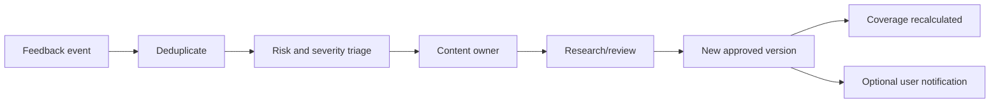

### Triage rules

| Feedback | Приоритет |
|---|---|
| unsafe emergency/medical/legal instruction | immediate safety queue; actionable content may be temporarily limited |
| broken or changed official source | high priority source review |
| repeated wrong-location reports | Local Intelligence gap |
| repeated missing task/query | Coverage gap and roadmap candidate |
| unclear wording | editorial improvement queue |
| suggestion without evidence | research input, не автоматическое изменение |

Точные SLA устанавливаются только после оценки размера команды и baseline. Документ не обещает пользователю срок, который проект не способен выдержать.

### Privacy и moderation

- feedback работает без обязательного аккаунта;
- не просить паспортные, медицинские, immigration или финансовые данные;
- page version, locale, task и coarse city context можно прикреплять автоматически;
- свободный текст проходит moderation и redaction;
- защита от spam/rate abuse обязательна;
- уведомление об исправлении возможно только с отдельным consent;
- feedback не публикуется как пользовательский отзыв и не меняет ответ автоматически.

### Feedback data model

```text
feedback_id
content_id
content_version
task_id
feedback_type
reason_code
locale
location_scope
created_at
triage_severity
status
duplicate_group
resolution_version
```

### Интеграция с Coverage Dashboard

Dashboard добавляет:

- Helpful/Not helpful rate с minimum sample threshold;
- outdated reports и time to triage;
- unresolved feedback backlog по risk;
- top missing tasks и wrong-location gaps;
- source-unavailable incidents;
- content versions с ухудшением полезности;
- feedback-to-fix lead time;
- долю закрытых feedback loops.

Feedback metrics нельзя интерпретировать без объёма выборки и task mix. Один негативный сигнал не понижает coverage автоматически; повторяющиеся и high-risk signals создают review task.

## 24. План миграции без поломки URL

### Этап 0 — заморозить расширение главной

- не публиковать draft с 18 task cards;
- зафиксировать текущие 616 sitemap URLs и поисковые запросы;
- измерить baseline `Time to Useful Action`, zero-result rate и action conversion;
- зафиксировать исходный Coverage Score по task domains и cities;
- зафиксировать текущие content states, source dates и missing trust fields;
- добавить automated 3-click tests для десяти основных задач.

### Этап 1 — единая taxonomy

- создать canonical task IDs, intents, synonyms и location rules;
- хранить их в общем data layer, а не в отдельных массивах Home, Search, Start и Journeys;
- добавить Golden Rule и Product Value publication gate в content governance;
- внедрить Content Lifecycle states, trust schema и version history;
- использовать те же IDs в web, iOS, admin, Supabase и Naruto.

Минимальные поля контента: `task_id`, `question`, `answer_scope`, `required_items`, `next_action`, `official_source`, `location_scope`, `content_depth`, `verified_at`, `risk_level`, `user_leaves_with`, `journey_stage`.

### Этап 2 — новый Home и answer template

- внедрить новый 10-block Home;
- сначала выпустить 10 task hubs;
- добавить trust card и feedback controls в answer template;
- подключить feedback только после privacy, moderation и triage readiness;
- split pages выпускать постепенно, сохраняя старые summary hubs.

### Этап 3 — dual routing

- новые clean URLs становятся canonical только после готовности контента;
- старые `/categories/*`, `/essentials/*`, `/guides/*`, `/organizations/*` продолжают работать;
- при точном соответствии использовать `301`; при неполном соответствии оставить legacy URL и canonical на себя;
- не делать массовые redirects на главную.

### Этап 4 — обновить индексы

- внутренние ссылки;
- sitemap и breadcrumbs;
- search index и synonyms;
- Local Intelligence mapping и coverage gaps;
- admin preview;
- Coverage Dashboard;
- Content Lifecycle queue и review calendar;
- feedback triage queue и resolution links;
- iOS deep links;
- Naruto citations;
- Supabase route registry.

### Этап 5 — QA и наблюдение

- проверка всех 616 старых URL на `200/301`;
- отсутствие redirect chains и loops;
- Search QA по intents EN/NL/RU;
- mobile 390px, tablet, 1024px, 1280px и desktop;
- keyboard, screen reader, contrast, reduced motion;
- trust indicators, feedback controls и error recovery;
- проверка version consistency между Web, iOS, Search и Naruto;
- 404, zero-result, click-depth, TTUA и official-source click monitoring 30 дней.

### Этап 6 — только после подтверждения

- убрать legacy links из UI;
- оставить redirects минимум 12 месяцев;
- удалять старый код только после отсутствия значимого трафика и deep links.

## 25. Архитектурное влияние на экосистему YouNew

| Компонент | Требуемое изменение |
|---|---|
| Web | новый Home, task hubs, answer template, trust card, feedback controls, Local Intelligence и route resolver |
| iOS | та же taxonomy, Product Journeys, trust indicators, feedback events и deep-link mapping |
| Supabase | task/content/source/version/value-contract/feedback tables, lifecycle transitions и optional profile sync |
| Admin | Coverage Dashboard, lifecycle queue, trust completeness, feedback triage и review calendar |
| Search | intent-first ranking; sensitive topics не должны попадать по слабому совпадению |
| Naruto | safety triage, максимум одно блокирующее уточнение, только published approved version и citations |
| Analytics | click depth, TTUA, zero results, useful-action events, journey progress, trust/source events и feedback resolution |

## 26. Критерии утверждения перед реализацией

- Golden Rule принята как publication и UX criterion;
- утверждены 10 home tasks и 10 primary navigation items;
- утверждено различие Explore, Guides, Search, Start и Journeys;
- утверждены Tourist, Student, Worker и Refugee Product Journeys;
- согласованы clean URLs и redirect matrix;
- определён content owner для каждого P0 task;
- утверждены единый answer template и Product Value contract;
- согласованы Local Intelligence scope и правила volatile data;
- утверждены AI safety/clarification rules;
- согласованы формула Coverage Dashboard и источники metrics;
- измерен baseline Time to Useful Action;
- утверждены Content Lifecycle states, роли и publication gates;
- утверждены Trust Layer labels, evidence levels и visible trust card;
- согласованы feedback taxonomy, privacy, moderation и triage ownership;
- определено, когда outdated content ограничивается, обновляется или архивируется;
- подтверждено, что отдельный рекламный блок не возвращается на Home;
- составлены 3-click tests;
- только после этого начинается реализация.
