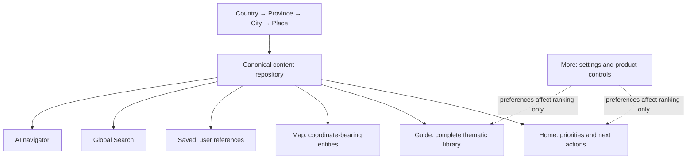

# YouNew Guide — final target sitemap

## Architectural contract

One canonical repository powers Home, Guide, global Search, Map, Saved and AI. A material is stored once under a stable `canonical_id`; every card, recommendation, search result, map callout and AI citation is a projection or reference.

## Primary navigation

1. **Home** — personalized priority view, not a library.
2. **Guide** — complete, unfiltered-by-access thematic catalog.
3. **Map** — geographic projection of coordinate-bearing content.
4. **Saved** — references to canonical items.
5. **More** — profile, language, accessibility, privacy, legal, feedback and product settings.

Search is a global action in Home and Guide. AI is a search/context action and must cite canonical items; it is not a primary tab and owns no duplicate knowledge.

## Guide

- Getting started
  - Arrival and first 72 hours
  - Registration and identity
  - First-week checklist
  - Settling-in journeys
- Housing
  - Finding a home
  - Renting and contracts
  - Registration at address
  - Costs, utilities and allowances
  - Tenant rights and disputes
- Official services
  - Municipality and BRP
  - BSN and DigiD
  - Immigration and residence
  - Taxes, benefits and government portals
  - Documents, letters and fines
  - Trusted institutions and sources
- Work and money
  - Finding work
  - Contracts and employment rights
  - Salary, payslip and taxes
  - Banking and payments
  - Entrepreneurship
- Study
  - Schools and childcare
  - Higher education
  - Student administration and finance
  - Dutch language
  - Integration, KNM, history and society
- Health and safety
  - Health insurance
  - GP, pharmacy and hospital
  - Mental and social support
  - Emergency actions
  - Police, scams, discrimination and legal safety
- Transport
  - Public transport
  - Trains and intercity travel
  - Cycling
  - Driving, parking and fines
  - Airports and international travel
- Explore
  - Country overview
  - Culture and daily life
  - History and holidays
  - Attractions, food and events
  - Cities and provinces as editorial collections

## Geographic hierarchy

- Country: Netherlands
  - Province: North Holland
    - City: Amsterdam
      - Place: Rijksmuseum

Geography never replaces category. Amsterdam has entity type `city`; Housing has taxonomy type `category`; rent registration is an `article` or `official_service`; Rijksmuseum is a `place`; North Holland is a `province`.

An item may reference multiple geographic entities through `geography_refs`. National rules use the Country scope. A place may have coordinates; an article normally does not, but may link to related services or places.

## Five user journeys

### New expat

Home ranks First-week checklist, municipality registration, BSN, DigiD, housing and health insurance. Guide still shows all eight categories. Search finds every canonical item. Map shows municipality offices and nearby services.

### International student

Home ranks student registration, housing, university administration, banking, transport and Dutch learning. Work, family, resident and tourist material remains visible in Guide and Search.

### Tourist

Home ranks emergency help, transport, city highlights, events and cultural etiquette. Housing, work, study and official-service materials remain browseable and searchable without changing persona.

### Working resident

Home ranks payslip, tax, employment rights, healthcare and saved city services. Study, newcomer and visitor materials remain available through the same Guide taxonomy.

### Urgent help

Home emergency shortcut opens the canonical Emergency action; Search recognizes 112, lost passport, police, pharmacy and crisis synonyms; Map shows coordinate-bearing urgent services. The full Guide remains reachable after the urgent flow.

## Proof of universal access

- `audience_tags` participate only in ranking and recommended filters.
- Guide queries never include an audience exclusion predicate.
- Search indexes every published canonical ID and all localized aliases.
- Map eligibility is determined only by valid coordinates/geography, never persona.
- Home recommendations always link to canonical IDs also present in Guide and Search.
- Saved stores canonical IDs, so a change of persona cannot invalidate saved content.

